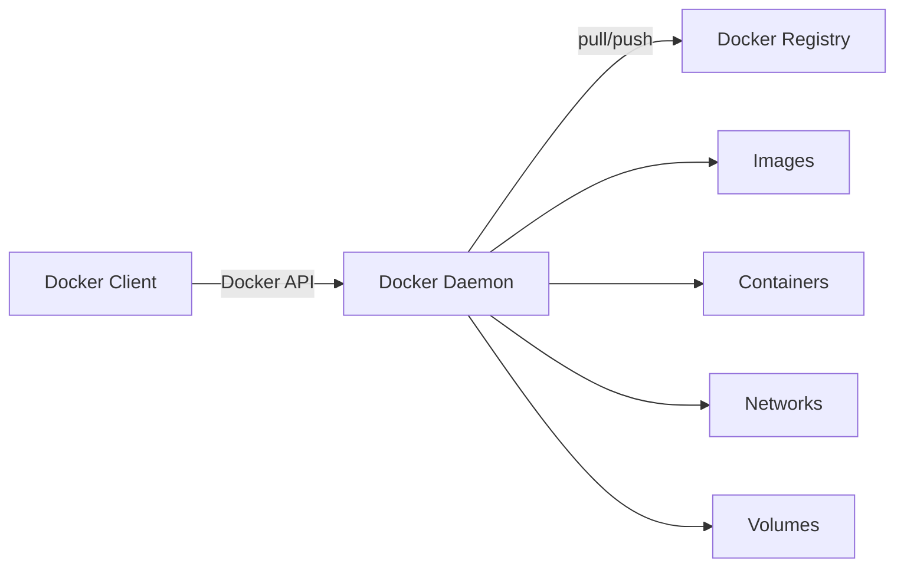
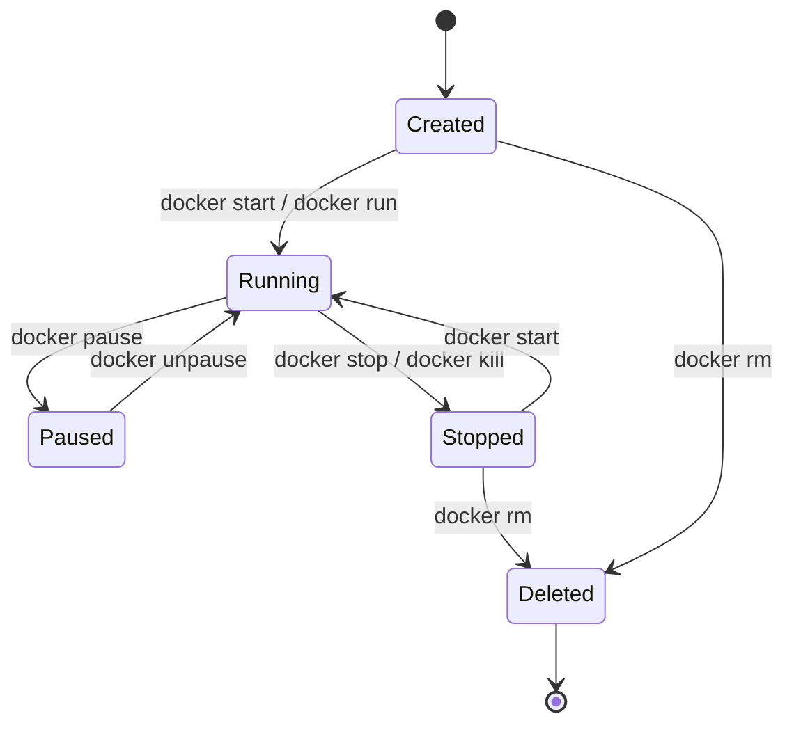
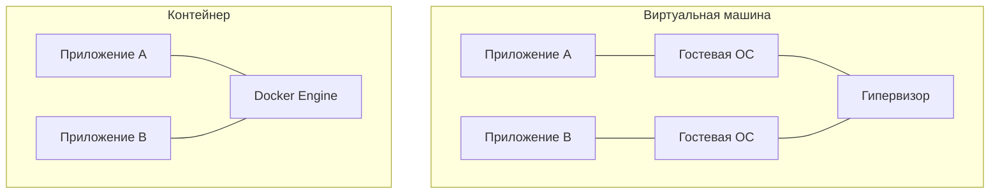

---

tags:

- docker

- контейнеризация

- devops

- docker-compose

aliases:

- Docker

- Контейнеры

- Containerization

---

  

# Docker

  

Docker — открытая платформа для разработки, доставки и запуска приложений в изолированных средах, называемых [[Контейнер|контейнерами]]. Позволяет упаковать приложение со всеми зависимостями в единый [[Docker Image|образ]], запускаемый на любой системе с Docker.

  

> [!info] История

> Docker представлен в 2013 году компанией dotCloud (позже — Docker, Inc.). До Docker существовали [[LXC]], FreeBSD Jails, но именно Docker сделал контейнеры массовыми.

  

---

  

## Основные проблемы, которые решает Docker

  

### 1. «Работает на моей машине»

  

Одинаковое окружение везде — на машине разработчика, тестовом стенде и продакшн-сервере.

  

### 2. Сложность настройки окружения

  

Готовый [[Docker Image|образ]] вместо ручной установки всех зависимостей.

  

### 3. Конфликты зависимостей

  

[[Контейнер|Контейнеры]] изолируют зависимости каждого приложения — разные версии библиотек не конфликтуют.

  

### 4. Эффективное использование ресурсов

  

Контейнеры легче [[Виртуальная машина|виртуальных машин]], позволяют запускать больше приложений на том же оборудовании.

  

### 5. Масштабирование

  

Легко создавать множество копий приложения для обработки увеличенной нагрузки.

  

---

  

## Архитектура Docker

  

Docker использует клиент-серверную архитектуру:

  



  

### Docker Client (клиент)

  

- Интерфейс командной строки (`docker`)

- Отправляет команды [[Docker Daemon|Docker демону]]

- Может подключаться к удалённым демонам

  

### Docker Daemon (демон/сервер)

  

- Фоновый процесс (`dockerd`)

- Управляет образами, контейнерами, сетями и [[Volume|томами]]

- Слушает Docker API запросы

  

### Docker Registry (реестр)

  

- Хранилище [[Docker Image|образов]]

- **Docker Hub** — публичный реестр (hub.docker.com)

- Можно создавать приватные реестры

- Содержит официальные образы популярных приложений

  

### Docker Objects (объекты)

  

| Объект | Описание |

|---|---|

| **Images** | Шаблоны для создания контейнеров |

| **Containers** | Запущенные экземпляры образов |

| **Networks** | Связи между контейнерами |

| **Volumes** | Постоянное хранилище данных |

  

---

  

## Основные преимущества Docker

  

### 1. Консистентность окружения

  

- Одинаковая работа на dev, test, prod

- Устранение «works on my machine»

- Воспроизводимые сборки

  

### 2. Изоляция приложений

  

- Каждый [[Контейнер|контейнер]] работает изолированно

- Конфликты зависимостей исключены

- Повышенная безопасность через изоляцию

  

### 3. Скорость и эффективность

  

- Быстрый запуск (секунды, не минуты)

- Эффективное использование ресурсов

- Меньше overhead по сравнению с [[Виртуальная машина|VM]]

  

### 4. Портативность

  

- Запуск на любой системе с Docker

- Легкая миграция между облачными провайдерами

- Одинаковая работа на Windows, macOS, Linux

  

### 5. Масштабируемость

  

- Легко создавать множество экземпляров

- Горизонтальное масштабирование

- Интеграция с [[Kubernetes]], Docker Swarm

  

### 6. DevOps и CI/CD

  

- Упрощение процессов развертывания

- Интеграция с CI/CD пайплайнами

- Быстрые откаты к предыдущим версиям

  

### 7. Экосистема

  

- Огромное количество готовых [[Docker Image|образов]] на Docker Hub

- Активное сообщество

- Богатая документация и инструменты

  

---

  

## Основные концепции и термины

  

### Image (Образ)

  

> [!note] Docker Image

> Read-only шаблон для создания [[Контейнер|контейнеров]]. Содержит ОС, приложение и все зависимости. Состоит из [[Layer|слоёв]]. Создаётся из [[Dockerfile]] или `docker commit`.

  

### Container (Контейнер)

  

> [!note] Контейнер

> Запущенный экземпляр [[Docker Image|образа]]. Изолированная среда выполнения с собственной файловой системой, процессами и сетью. Подробнее → [[Контейнер]]

  

### Dockerfile

  

> [!note] Dockerfile

> Текстовый файл с инструкциями для сборки [[Docker Image|образа]]. Версионируется вместе с кодом. Автоматизирует создание образов.

  

### Layer (Слой)

  

- Каждая инструкция в [[Dockerfile]] создаёт слой

- Слои кэшируются и переиспользуются

- Неизменяемые (immutable)

- Экономят место и время сборки

  

### Volume (Том)

  

> [!note] Volume

> Механизм постоянного хранения данных. Данные переживают удаление контейнера. Может разделяться между [[Контейнер|контейнерами]]. Управляется Docker.

  

### Network (Сеть)

  

Позволяет контейнерам общаться друг с другом. Изолирует трафик.

  

| Тип | Описание | Когда использовать |

|---|---|---|

| **bridge** | По умолчанию. Виртуальный мост `docker0` для контейнеров на одном хосте | Чаще всего |

| **host** | Контейнер использует сеть хоста напрямую. IP контейнера = IP хоста | Максимальная производительность, нет изоляции |

| **overlay** | Виртуальная сеть поверх нескольких хостов ([[Docker Swarm]], [[Kubernetes]]) | Распределённые кластеры |

| **none** | Контейнер без сети. Только localhost | Изоляция, кастомные настройки |

  

### Registry (Реестр)

  

Хранилище и дистрибуция образов. Docker Hub — публичный реестр. Можно развернуть приватный. Поддержка версионирования через теги.

  

---

  

## Основные команды Docker

  

### Работа с образами

  

```bash

docker pull nginx:latest # Скачать образ из реестра

docker images # Список локальных образов

docker build -t myapp:1.0 . # Построить образ из Dockerfile

docker rmi nginx:latest # Удалить образ

docker history nginx # Просмотр истории образа

docker search nginx # Поиск образов в Docker Hub

docker save -o myapp.tar myapp:1.0 # Сохранить образ в файл

docker load -i myapp.tar # Загрузить образ из файла

docker tag myapp:1.0 myapp:latest # Пометить образ новым тегом

```

  

### Работа с контейнерами

  

```bash

docker run -d --name mycontainer nginx # Запустить контейнер

docker run -d -p 8080:80 nginx # С пробросом портов

docker run -d -v /host/path:/container/path nginx # С volume

docker run -d -e "VAR=value" nginx # С переменными окружения

docker ps # Список запущенных контейнеров

docker ps -a # Все контейнеры (включая остановленные)

docker stop mycontainer # Остановить

docker start mycontainer # Запустить остановленный

docker restart mycontainer # Перезапустить

docker rm mycontainer # Удалить

docker rm -f mycontainer # Удалить запущенный (force)

docker logs mycontainer # Просмотр логов

docker logs -f mycontainer # Следить за логами

docker exec -it mycontainer bash # Выполнить команду в контейнере

docker stats # Использование ресурсов

docker inspect mycontainer # Информация о контейнере

docker cp file.txt mycontainer:/path/ # Копирование файлов в контейнер

docker cp mycontainer:/path/file.txt .# Копирование файлов из контейнера

```

  

### Очистка

  

```bash

docker container prune # Удалить все остановленные контейнеры

docker image prune # Удалить неиспользуемые образы

docker system prune # Удалить все неиспользуемые ресурсы

docker system prune -a --volumes # Удалить всё (включая volumes)

```

  

---

  

## Примеры Dockerfile

  

### PHP приложение

  

```dockerfile

FROM php:8.2-apache

  

LABEL maintainer="dev@example.com"

LABEL version="1.0"

LABEL description="PHP Application"

  

RUN apt-get update && apt-get install -y \

git \

curl \

libpng-dev \

libonig-dev \

libxml2-dev \

zip \

unzip

  

RUN apt-get clean && rm -rf /var/lib/apt/lists/*

  

RUN docker-php-ext-install pdo_mysql mbstring exif pcntl bcmath gd

  

COPY --from=composer:latest /usr/bin/composer /usr/bin/composer

  

WORKDIR /var/www/html

COPY . /var/www/html

  

RUN composer install --no-dev --optimize-autoloader

  

RUN chown -R www-data:www-data /var/www/html \

&& chmod -R 755 /var/www/html/storage

  

EXPOSE 80

CMD ["apache2-foreground"]

```

  

### Node.js приложение (multi-stage)

  

```dockerfile

FROM node:18 AS builder

WORKDIR /app

COPY package*.json ./

RUN npm install

COPY . .

RUN npm run build

  

FROM node:18-alpine

WORKDIR /app

COPY --from=builder /app/dist ./dist

COPY --from=builder /app/node_modules ./node_modules

  

USER node

  

EXPOSE 3000

  

HEALTHCHECK --interval=30s --timeout=3s --start-period=5s --retries=3 \

CMD node healthcheck.js

  

CMD ["node", "dist/main.js"]

```

  

---

  

## Best Practices

  

> [!tip] Основные правила

> - Используйте **официальные базовые образы** (`FROM node:18-alpine`, не `FROM someuser/node`)

> - Используйте **.dockerignore** (node_modules, .git, .env, *.md, .DS_Store)

> - **Минимизируйте слои** — объединяйте `RUN` инструкции

> - Используйте **multi-stage builds**

> - **Не запускайте от root** (`USER nodejs`)

> - Используйте **конкретные версии** (`node:18.16.0-alpine`, не `node:latest`)

> - **Кэшируйте зависимости** — сначала `COPY package*.json`, потом `COPY .`

  

### Минимизация слоёв

  

```dockerfile

# Хорошо — один слой

RUN apt-get update && apt-get install -y \

package1 \

package2 \

&& rm -rf /var/lib/apt/lists/*

  

# Плохо — три слоя

RUN apt-get update

RUN apt-get install -y package1

RUN apt-get install -y package2

```

  

### Кэширование зависимостей

  

```dockerfile

COPY package*.json ./

RUN npm install

COPY . .

```

  

---

  

## Use Cases

  

| Сценарий | Описание |

|---|---|

| **Микросервисы** | Каждый сервис в отдельном [[Контейнер|контейнере]]. Независимое развёртывание и масштабирование |

| **Разработка** | Быстрая настройка окружения. Одинаковое окружение для всей команды |

| **CI/CD** | Консистентные сборки. Быстрое тестирование. Автоматизированное развёртывание |

| **Тестирование** | Изолированные тестовые окружения. Параллельное выполнение тестов |

| **Миграция в облако** | Портативность между облачными провайдерами. Локальное тестирование облачных приложений |

  

---

  

## Что такое контейнер

  

> [!abstract] Определение

> **Контейнер** — стандартизированная единица ПО, упаковывающая код приложения и все его зависимости для надёжной работы в любом окружении. Изолированная среда выполнения: код, runtime, системные инструменты, библиотеки и настройки.

  

### Технические основы

  

Контейнеры построены на технологиях ядра Linux:

  

#### Linux Namespaces

  

| Namespace | Что изолирует |

|---|---|

| **PID** | Процессы (контейнер видит только свои) |

| **Network** | Сеть (свой IP, порты, таблицы маршрутизации) |

| **Mount** | Файловую систему |

| **IPC** | Межпроцессное взаимодействие |

| **UTS** | Hostname и domain name |

| **User** | Пользователей и группы |

| **Cgroup** | Ресурсы и их ограничение |

  

#### Control Groups (cgroups)

  

- Ограничение CPU (количество ядер, доля времени)

- Ограничение памяти (RAM, swap)

- Ограничение дисковых операций (I/O)

- Ограничение сетевой пропускной способности

- Учёт использования ресурсов

  

#### Union File Systems (UnionFS)

  

- Образ состоит из read-only [[Layer|слоёв]]

- Контейнер добавляет writable слой сверху

- Эффективное использование места

- Быстрое создание контейнеров

  

### Жизненный цикл контейнера

  



  

| Состояние | Команда | Описание |

|---|---|---|

| **Created** | `docker create --name myapp nginx` | Создан, но не запущен. Файловая система подготовлена |

| **Running** | `docker run --name myapp nginx` | Активен, процессы выполняются |

| **Paused** | `docker pause myapp` | Процессы заморожены, контейнер в памяти |

| **Stopped** | `docker stop myapp` / `docker kill myapp` | Процессы завершены, ФС сохранена |

| **Deleted** | `docker rm myapp` | Контейнер и writable layer удалены |

  

### Ключевые характеристики

  

**Легковесность** — образ от нескольких MB (Alpine ~5MB), запуск менее секунды, можно запустить сотни на одном хосте.

  

**Изоляция** — процессы не видят друг друга, отдельная ФС, изолированная сеть, ограничение ресурсов.

  

**Портативность** — «Build once, run anywhere», работа в облаке и on-premise.

  

**Эфемерность** — данные не сохраняются после удаления (без [[Volume|volumes]]), легко создавать и удалять. Философия «cattle, not pets».

  

**Иммутабельность** — образ неизменяем, изменения в контейнере не влияют на образ, лёгкие откаты.

  

**Масштабируемость** — быстрое создание множества экземпляров, горизонтальное масштабирование, load balancing.

  

### Контейнеры vs Виртуальные машины

  



  

| Характеристика | Контейнер | Виртуальная машина |

|---|---|---|

| **Размер** | Мегабайты | Гигабайты |

| **Время запуска** | Секунды | Минуты |

| **Изоляция** | На уровне процессов | Полная |

| **Производительность** | Близка к native | Есть overhead |

| **ОС** | Общее ядро | Отдельная ОС |

| **Плотность** | Сотни на хосте | Десятки на хосте |

| **Портативность** | Высокая | Средняя |

  

> [!tip] Когда что использовать

> **Контейнеры** — микросервисы, CI/CD, быстрое масштабирование, современные приложения.

> **VM** — полная изоляция, разные ОС, legacy-приложения, высокие требования к безопасности.

> **Гибрид** — VM для изоляции окружений, контейнеры внутри VM для приложений.

  

### Типы контейнеров

  

| Тип | Описание | Примеры |

|---|---|---|

| **Application Containers** | Одно приложение, один процесс | Веб-сервер, API, БД |

| **System Containers** | Полноценная система, несколько процессов, init | [[LXC]]/LXD |

| **Sidecar Containers** | Дополняют основной контейнер, общий namespace | Логирование, мониторинг, прокси |

| **Init Containers** | Запускаются до основного контейнера | Миграции БД, настройка конфигурации |

  

---

  

## Безопасность контейнеров

  

> [!warning] Важно

> Контейнеры не обеспечивают полную изоляцию. Для максимальной безопасности комбинируйте контейнеры с VM.

  

### Лучшие практики

  

**1. Минимальные базовые образы**

  

```dockerfile

FROM alpine:3.18 # Минимальный дистрибутив

FROM gcr.io/distroless/nodejs18 # Без package manager и shell

```

  

**2. Не запускайте от root**

  

```dockerfile

RUN adduser -D appuser

USER appuser

```

  

**3. Сканируйте образы на уязвимости**

  

```bash

docker scan myapp:latest

trivy image myapp:latest

```

  

**4. Read-only filesystem**

  

```bash

docker run --read-only myapp

```

  

**5. Ограничивайте capabilities**

  

```bash

docker run --cap-drop=ALL --cap-add=NET_BIND_SERVICE myapp

```

  

**6. Секреты — не в образ**

  

```bash

# Используйте Docker secrets или переменные окружения

docker run -e DB_PASSWORD=$DB_PASSWORD myapp

```

  

**7. Ограничивайте ресурсы**

  

```bash

docker run --memory=512m --cpus=1 myapp

```

  

**8. Регулярно обновляйте образы**

  

```bash

docker pull node:18-alpine

docker build --no-cache -t myapp:latest .

```

  

---

  

## Networking в контейнерах

  

### Проброс портов

  

```bash

docker run -p 8080:80 nginx # Один порт

docker run -p 127.0.0.1:8080:80 nginx # На конкретный интерфейс

docker run -p 80 nginx # Случайный порт хоста

docker run -p 80:80 -p 443:443 nginx # Несколько портов

```

  

### Управление сетями

  

```bash

docker network create my-bridge # Создать сеть

docker run --network my-bridge nginx # Подключить контейнер

docker network ls # Список сетей

docker network inspect my-bridge # Информация о сети

```

  

---

  

## Storage в контейнерах

  

| Тип | Управление | Производительность | Use Case |

|---|---|---|---|

| **Volume** | Docker | Высокая | Продакшн данные |

| **Bind Mount** | Пользователь | Средняя | Разработка |

| **tmpfs** | Автоматически | Очень высокая | Временные данные |

  

### Volumes (рекомендуется)

  

```bash

docker volume create mydata

docker run -v mydata:/data nginx

docker volume ls

docker volume rm mydata

```

  

### Bind Mounts

  

```bash

docker run -v /host/path:/container/path nginx

docker run -v /host/path:/container/path:ro nginx # Read-only

```

  

### tmpfs (в памяти)

  

```bash

docker run --tmpfs /tmp nginx

```

  

---

  

## Мониторинг и логирование

  

### Ресурсы

  

```bash

docker stats # Все контейнеры

docker stats mycontainer # Конкретный

docker inspect mycontainer # Детальная информация

```

  

### Логи

  

```bash

docker logs mycontainer # Просмотр логов

docker logs -f mycontainer # Следить в реальном времени

docker logs --tail 100 mycontainer # Последние N строк

docker logs -t mycontainer # С временными метками

docker logs --since 2024-01-01 mycontainer # За период

```

  

### Logging drivers

  

```bash

docker run --log-driver json-file nginx # По умолчанию

docker run --log-driver syslog nginx # Syslog

docker run --log-driver journald nginx # Journald

docker run --log-driver gelf \

--log-opt gelf-address=udp://graylog:12201 nginx # Graylog

docker run --log-driver none nginx # Отключить логи

```

  

---

  

## Docker Compose

  

> [!abstract] Определение

> **Docker Compose** — инструмент для определения и управления многоконтейнерными Docker-приложениями через YAML-файл. Одна команда — `docker compose up -d` — создаёт и запускает все сервисы.

  

### Зачем нужен

  

```bash

# Без Compose — вручную:

docker network create myapp-network

docker volume create db-data

docker run -d --name db --network myapp-network \

-v db-data:/var/lib/mysql \

-e MYSQL_ROOT_PASSWORD=secret \

mysql:8.0

docker run -d --name redis --network myapp-network redis:7

docker run -d --name web --network myapp-network \

-p 80:80 \

-e DB_HOST=db \

-e REDIS_HOST=redis \

myapp:latest

  

# С Compose:

docker compose up -d

```

  

### Проверка версии

  

```bash

docker compose version # V2 (рекомендуется, входит в Docker Desktop)

docker-compose version # V1 (legacy)

```

  

### Структура docker-compose.yml

  

```yaml

version: '3.8'

  

services: # Определение сервисов

service1:

# ...

service2:

# ...

  

networks: # Определение сетей (опционально)

network1:

  

volumes: # Определение volumes (опционально)

volume1:

  

configs: # Конфигурационные файлы (опционально)

config1:

  

secrets: # Секреты (опционально)

secret1:

```

  

### Полный пример веб-приложения

  

**docker-compose.yml:**

  

```yaml

version: '3.8'

  

services:

nginx:

image: nginx:1.25-alpine

container_name: myapp-nginx

restart: unless-stopped

ports:

- "80:80"

- "443:443"

volumes:

- ./nginx/conf.d:/etc/nginx/conf.d:ro

- ./nginx/ssl:/etc/nginx/ssl:ro

- web-static:/var/www/html/static

depends_on:

- app

networks:

- frontend

- backend

healthcheck:

test: ["CMD", "wget", "--quiet", "--tries=1", "--spider", "http://localhost/health"]

interval: 30s

timeout: 10s

retries: 3

start_period: 40s

  

app:

build:

context: ./app

dockerfile: Dockerfile

args:

- PHP_VERSION=8.2

container_name: myapp-php

restart: unless-stopped

working_dir: /var/www/html

volumes:

- ./app:/var/www/html

- web-static:/var/www/html/static

environment:

- APP_ENV=production

- APP_DEBUG=false

- DB_HOST=db

- DB_PORT=3306

- DB_DATABASE=${DB_DATABASE}

- DB_USERNAME=${DB_USERNAME}

- DB_PASSWORD=${DB_PASSWORD}

- REDIS_HOST=redis

- REDIS_PORT=6379

env_file:

- .env

depends_on:

db:

condition: service_healthy

redis:

condition: service_started

networks:

- backend

deploy:

resources:

limits:

cpus: '2'

memory: 1G

reservations:

cpus: '0.5'

memory: 512M

  

db:

image: mysql:8.0

container_name: myapp-mysql

restart: unless-stopped

ports:

- "3306:3306"

volumes:

- db-data:/var/lib/mysql

- ./mysql/init:/docker-entrypoint-initdb.d:ro

- ./mysql/conf.d:/etc/mysql/conf.d:ro

environment:

- MYSQL_ROOT_PASSWORD=${DB_ROOT_PASSWORD}

- MYSQL_DATABASE=${DB_DATABASE}

- MYSQL_USER=${DB_USERNAME}

- MYSQL_PASSWORD=${DB_PASSWORD}

command: --default-authentication-plugin=mysql_native_password

networks:

- backend

healthcheck:

test: ["CMD", "mysqladmin", "ping", "-h", "localhost", "-u", "root", "-p${DB_ROOT_PASSWORD}"]

interval: 10s

timeout: 5s

retries: 5

start_period: 30s

  

redis:

image: redis:7-alpine

container_name: myapp-redis

restart: unless-stopped

ports:

- "6379:6379"

volumes:

- redis-data:/data

- ./redis/redis.conf:/usr/local/etc/redis/redis.conf:ro

command: redis-server /usr/local/etc/redis/redis.conf

networks:

- backend

healthcheck:

test: ["CMD", "redis-cli", "ping"]

interval: 10s

timeout: 3s

retries: 5

  

worker:

build:

context: ./app

dockerfile: Dockerfile

container_name: myapp-worker

restart: unless-stopped

command: php artisan queue:work --sleep=3 --tries=3

volumes:

- ./app:/var/www/html

environment:

- APP_ENV=production

- DB_HOST=db

- REDIS_HOST=redis

env_file:

- .env

depends_on:

- db

- redis

networks:

- backend

deploy:

replicas: 2

  

scheduler:

build:

context: ./app

dockerfile: Dockerfile

container_name: myapp-scheduler

restart: unless-stopped

command: php artisan schedule:work

volumes:

- ./app:/var/www/html

environment:

- APP_ENV=production

- DB_HOST=db

- REDIS_HOST=redis

env_file:

- .env

depends_on:

- db

- redis

networks:

- backend

  

networks:

frontend:

driver: bridge

backend:

driver: bridge

internal: true

  

volumes:

db-data:

driver: local

redis-data:

driver: local

web-static:

driver: local

```

  

**.env:**

  

```env

DB_ROOT_PASSWORD=supersecret

DB_DATABASE=myapp

DB_USERNAME=myapp_user

DB_PASSWORD=secret123

APP_KEY=base64:randomgeneratedkey

APP_URL=https://myapp.com

```

  

---

  

## Команды Docker Compose

  

### Жизненный цикл

  

```bash

docker compose up # Запустить все сервисы

docker compose up -d # В фоне (detached)

docker compose up nginx # Конкретный сервис

docker compose up --build # Пересобрать образы перед запуском

docker compose up --force-recreate # Пересоздать контейнеры

docker compose stop # Остановить все сервисы

docker compose down # Остановить и удалить контейнеры

docker compose down -v # + удалить volumes

docker compose down --rmi all -v # + удалить образы

```

  

### Отдельные сервисы

  

```bash

docker compose start nginx # Запустить остановленный

docker compose stop nginx # Остановить

docker compose restart nginx # Перезапустить

docker compose pause nginx # Приостановить

docker compose unpause nginx # Возобновить

docker compose rm nginx # Удалить остановленный

```

  

### Сборка

  

```bash

docker compose build # Собрать все образы

docker compose build app # Конкретный сервис

docker compose build --no-cache # Без кэша

docker compose build --parallel # Параллельная сборка

```

  

### Информация

  

```bash

docker compose ps # Запущенные контейнеры

docker compose ps -a # Все контейнеры

docker compose logs # Логи всех сервисов

docker compose logs -f # Следить за логами

docker compose logs -f nginx # Логи конкретного сервиса

docker compose logs --tail=100 app # Последние N строк

docker compose images # Список образов

docker compose top # Использование ресурсов

docker compose events # События от сервисов

```

  

### Выполнение команд

  

```bash

docker compose exec app bash # В запущенном контейнере

docker compose exec -T app php artisan migrate # Без TTY (для скриптов)

docker compose run app php artisan tinker # Новый контейнер

docker compose run --no-deps app npm test # Без зависимостей

docker compose run --rm app php artisan test # Удалить после выполнения

```

  

### Масштабирование

  

```bash

docker compose up -d --scale worker=3

```

  

### Проверка конфигурации

  

```bash

docker compose config # Валидация + финальная конфигурация

docker compose config --services # Список сервисов

docker compose config --volumes # Список volumes

```

  

---

  

## Расширенные возможности Compose

  

### 1. Множественные файлы

  

```bash

docker compose -f docker-compose.yml -f docker-compose.override.yml up

docker compose -f docker-compose.yml -f docker-compose.dev.yml up

docker compose -f docker-compose.yml -f docker-compose.prod.yml up

```

  

**docker-compose.yml:**

  

```yaml

version: '3.8'

services:

app:

image: myapp:latest

environment:

- APP_ENV=production

```

  

**docker-compose.dev.yml:**

  

```yaml

version: '3.8'

services:

app:

build: .

volumes:

- .:/app

environment:

- APP_ENV=development

- APP_DEBUG=true

```

  

### 2. Расширение конфигураций (extends)

  

```yaml

# common-services.yml

version: '3.8'

services:

base-app:

image: node:18

restart: unless-stopped

networks:

- app-network

  

# docker-compose.yml

version: '3.8'

services:

web:

extends:

file: common-services.yml

service: base-app

ports:

- "3000:3000"

```

  

### 3. Якоря и алиасы YAML

  

```yaml

version: '3.8'

  

x-common-variables: &common-env

APP_ENV: production

LOG_LEVEL: info

  

x-common-healthcheck: &common-healthcheck

interval: 30s

timeout: 10s

retries: 3

start_period: 40s

  

services:

app1:

image: myapp:latest

environment:

<<: *common-env

SERVICE_NAME: app1

healthcheck:

<<: *common-healthcheck

test: ["CMD", "curl", "-f", "http://localhost/health"]

  

app2:

image: myapp:latest

environment:

<<: *common-env

SERVICE_NAME: app2

healthcheck:

<<: *common-healthcheck

test: ["CMD", "curl", "-f", "http://localhost/health"]

```

  

### 4. Profiles (группы сервисов)

  

```yaml

version: '3.8'

  

services:

web:

image: nginx

ports:

- "80:80"

  

db:

image: postgres

  

adminer:

image: adminer

profiles: ["debug"]

ports:

- "8080:8080"

  

test:

image: myapp:test

profiles: ["test"]

command: npm test

```

  

```bash

docker compose up # Без профилей — web и db

docker compose --profile debug up # С профилем debug

docker compose --profile debug --profile test up # Несколько профилей

```

  

### 5. Зависимости между сервисами

  

```yaml

services:

web:

image: nginx

depends_on:

app:

condition: service_healthy

db:

condition: service_started

  

app:

image: myapp

depends_on:

- db

healthcheck:

test: ["CMD", "curl", "-f", "http://localhost/health"]

interval: 10s

  

db:

image: postgres

healthcheck:

test: ["CMD-SHELL", "pg_isready -U postgres"]

interval: 10s

```

  

---

  

## Best Practices для Docker Compose

  

> [!tip] Правила

> - Используйте `.env` файлы для конфигурации

> - **Не коммитьте секреты** (добавьте `.env`, `.env.local`, `docker-compose.override.yml` в `.gitignore`)

> - Используйте named [[Volume|volumes]]

> - Настройте `restart` policy (`unless-stopped`, `always`, `on-failure`)

> - Добавьте healthchecks

> - Ограничивайте ресурсы через `deploy.resources`

> - Настройте логирование (`max-size`, `max-file`)

> - Разделяйте сети (frontend/backend, `internal: true`)

  

### Пример: логирование

  

```yaml

services:

app:

logging:

driver: "json-file"

options:

max-size: "10m"

max-file: "3"

```

  

### Пример: разделение сетей

  

```yaml

services:

nginx:

networks:

- frontend

- backend

app:

networks:

- backend

db:

networks:

- backend

  

networks:

frontend:

backend:

internal: true

```

  

---

  

## Примеры реальных стеков

  

### LEMP Stack (Linux, Nginx, MySQL, PHP)

  

```yaml

version: '3.8'

  

services:

nginx:

image: nginx:alpine

ports:

- "80:80"

volumes:

- ./src:/var/www/html

- ./nginx.conf:/etc/nginx/conf.d/default.conf

depends_on:

- php

  

php:

build:

context: .

dockerfile: Dockerfile.php

volumes:

- ./src:/var/www/html

depends_on:

- mysql

  

mysql:

image: mysql:8.0

environment:

MYSQL_ROOT_PASSWORD: root

MYSQL_DATABASE: myapp

volumes:

- mysql-data:/var/lib/mysql

  

volumes:

mysql-data:

```

  

### MERN Stack (MongoDB, Express, React, Node)

  

```yaml

version: '3.8'

  

services:

frontend:

build: ./frontend

ports:

- "3000:3000"

volumes:

- ./frontend:/app

- /app/node_modules

environment:

- REACT_APP_API_URL=http://localhost:5000

  

backend:

build: ./backend

ports:

- "5000:5000"

volumes:

- ./backend:/app

- /app/node_modules

environment:

- MONGO_URI=mongodb://mongo:27017/myapp

depends_on:

- mongo

  

mongo:

image: mongo:6

ports:

- "27017:27017"

volumes:

- mongo-data:/data/db

  

volumes:

mongo-data:

```

  

### WordPress Stack

  

```yaml

version: '3.8'

  

services:

wordpress:

image: wordpress:latest

ports:

- "8000:80"

environment:

WORDPRESS_DB_HOST: db

WORDPRESS_DB_USER: wordpress

WORDPRESS_DB_PASSWORD: wordpress

WORDPRESS_DB_NAME: wordpress

volumes:

- wordpress-data:/var/www/html

depends_on:

- db

  

db:

image: mysql:8.0

environment:

MYSQL_ROOT_PASSWORD: rootpassword

MYSQL_DATABASE: wordpress

MYSQL_USER: wordpress

MYSQL_PASSWORD: wordpress

volumes:

- db-data:/var/lib/mysql

  

phpmyadmin:

image: phpmyadmin:latest

ports:

- "8080:80"

environment:

PMA_HOST: db

PMA_USER: wordpress

PMA_PASSWORD: wordpress

depends_on:

- db

  

volumes:

wordpress-data:

db-data:

```

  

---

  

## Когда использовать Docker Compose

  

### Подходит для

  

> [!check] Используйте Docker Compose когда:

> - **Локальная разработка** — нужно быстро поднять окружение с несколькими сервисами (БД, кэш, брокер, приложение)

> - **Прототипирование** — быстрый запуск стека технологий без сложной настройки

> - **CI/CD** — воспроизводимые тестовые окружения в пайплайнах

> - **Малые и средние проекты** — когда нет необходимости в полноценном оркестраторе ([[Kubernetes]], Docker Swarm)

> - **Демо и презентации** — одна команда для запуска всего стека

> - **Обучение** — безопасная изолированная среда для экспериментов с технологиями

> - **Один сервер** — развёртывание нескольких сервисов на одном хосте

  

### Не подходит для

  

> [!caution] Рассмотрите alternatives когда:

> - **Мультихостовый кластер** — нужен [[Kubernetes]] или Docker Swarm для управления контейнерами на нескольких серверах

> - **High availability** — требуется автоматическое восстановление при отказе нод

> - **Сложное масштабирование** — нужна автоскалирование на основе метрик

> - **Продакшн на масштабе** — тысячи контейнеров, глобальное распределение

> - **Сложные деплойменты** — canary releases, blue-green, A/B тестирование на уровне инфраструктуры

> - **Секреты в продакшне** — нужны Vault, HashiCorp и интеграция с ними

  

### Сравнение с alternatives

  

| Инструмент | Масштаб | Сложность | Use Case |

|---|---|---|---|

| **Docker Compose** | Один хост | Низкая | Разработка, малые проекты, CI |

| **Docker Swarm** | Несколько хостов | Средняя | Малые кластеры, простой прод |

| **Kubernetes** | Любой масштаб | Высокая | Продакшн, enterprise, сложные системы |

| **Nomad** | Любой масштаб | Средняя | Гетерогенные нагрузки (контейнеры + VM) |

  

> [!tip] Эволюция

> Типичный путь: **Docker Compose** (разработка) → **Docker Compose** (CI/тестирование) → **Kubernetes** (продакшн).

> Docker Compose остаётся основным инструментом для разработки даже в проектах с Kubernetes в продакшне.

  

---

  

## Troubleshooting

  

### Проблемы с сетью

  

```bash

docker network ls

docker network inspect myapp_default

docker compose down && docker compose up # Пересоздать сети

```

  

### Проблемы с volumes

  

```bash

docker volume ls

docker volume inspect myapp_db-data

docker compose down -v # Очистить volumes

```

  

### Проблемы с портами

  

```bash

lsof -i :80 # Проверить занятые порты

netstat -tuln | grep 80

# Изменить порт: - "8080:80" вместо - "80:80"

```

  

### Проблемы с зависимостями

  

```bash

docker compose up db # Запускать по одному

docker compose up app

docker compose up nginx

```

  

### Проверка конфигурации

  

```bash

docker compose config # Валидация

docker compose config --resolve-image-digests

```