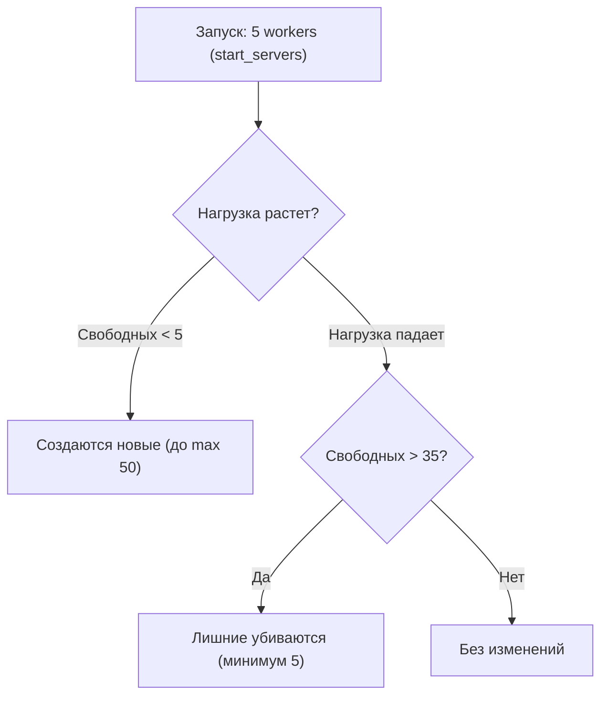

# PHP-FPM

  

## Содержание

  

- [[#Что такое PHP-FPM]]

- [[#Как работает PHP-FPM]]

- [[#Базовые настройки]]

- [[#Как запускается на сервере]]

- [[#Мониторинг и отладка]]

- [[#Оптимизация]]

- [[#Шпаргалка]]

  

---

  

## Что такое PHP-FPM

  

**PHP-FPM (FastCGI Process Manager)** — альтернативная реализация PHP FastCGI с дополнительными возможностями для высоконагруженных сайтов.

  

### Простыми словами

  

> PHP-FPM — это «менеджер процессов», который запускает PHP-скрипты и управляет рабочими процессами (workers).

  

---

  

### Зачем нужен PHP-FPM

  

**Без PHP-FPM (старый способ — mod_php):**

  


  

- ❌ Apache загружает PHP в каждый свой процесс (даже для статики)

- ❌ Потребляет много памяти

- ❌ Сложно масштабировать

- ❌ Нельзя использовать разные версии PHP

  

**С PHP-FPM:**

  


  

- ✅ PHP работает отдельно от веб-сервера

- ✅ Nginx может отдавать статику сам (быстрее)

- ✅ Меньше потребление памяти

- ✅ Легко масштабировать

- ✅ Можно запустить несколько версий PHP одновременно

- ✅ Лучший контроль над процессами

  

---

  

### Аналогия из жизни

  

**Без PHP-FPM (mod_php):**

  

> 🏪 **Магазин с продавцами**

>

> Каждый продавец (Apache процесс) = универсальный: продает товары, принимает оплату, выносит мусор, готовит кофе.

>

> ❌ Даже если клиент хочет просто взять товар, продавец занят другими делами.

  

**С PHP-FPM:**

  

> 🏪 **Магазин + отдельная кофейня**

>

> Продавцы (**Nginx**) — быстро отдают товары (статику), передают заказы на кофе (PHP) в кофейню.

>

> Бариста (**PHP-FPM**) — специализируются только на кофе (PHP). Можно нанять больше/меньше бариста. Отдельная очередь для кофе.

>

> ✅ Клиенты за товарами не ждут, пока готовится кофе

> ✅ Можно масштабировать отдельно

  

---

  

### Архитектура PHP-FPM

  

```

┌─────────────────────────────────────────────────────┐

│ Клиент (Браузер) │

└──────────────────┬──────────────────────────────────┘

│ HTTP запрос

▼

┌─────────────────────────────────────────────────────┐

│ Веб-сервер (Nginx / Apache) │

│ ┌─────────────────┐ ┌──────────────────────────┐ │

│ │ Статика │ │ PHP запросы │ │

│ │ (CSS, JS, IMG) │ │ (*.php) │ │

│ └─────────────────┘ └──────────────┬───────────┘ │

└────────────────────────────────────────┼────────────┘

│ FastCGI

▼

┌─────────────────────────────────────────────────────┐

│ PHP-FPM (Master процесс) │

│ ┌──────────────────────────────────────────────┐ │

│ │ Pool: www │ │

│ │ ┌─────────┐ ┌─────────┐ ┌─────────┐ │ │

│ │ │ Worker 1│ │ Worker 2│ │ Worker 3│ ... │ │

│ │ │ (PHP) │ │ (PHP) │ │ (PHP) │ │ │

│ │ └─────────┘ └─────────┘ └─────────┘ │ │

│ └──────────────────────────────────────────────┘ │

│ ┌──────────────────────────────────────────────┐ │

│ │ Pool: api (другая версия PHP) │ │

│ │ ┌─────────┐ ┌─────────┐ │ │

│ │ │ Worker 1│ │ Worker 2│ ... │ │

│ │ └─────────┘ └─────────┘ │ │

│ └──────────────────────────────────────────────┘ │

└─────────────────────────────────────────────────────┘

```

  

**Master процесс:**

  

- Управляет пулами (pools)

- Создает/убивает worker процессы

- Обрабатывает сигналы (reload, restart)

  

**Worker процесс:**

  

- Выполняет PHP код

- Обрабатывает один запрос за раз

- Автоматически перезапускается после N запросов

  

---

  

## Как работает PHP-FPM

  

### Процесс обработки запроса

  

```

1. Браузер → GET /index.php

↓

2. Nginx получает запрос

↓

3. Nginx определяет: это PHP файл

↓

4. Nginx отправляет запрос в PHP-FPM через FastCGI

(обычно через Unix socket или TCP)

↓

5. PHP-FPM Master выбирает свободный Worker

↓

6. Worker выполняет PHP скрипт

↓

7. Worker возвращает результат в Nginx

↓

8. Nginx отправляет ответ браузеру

↓

9. Worker освобождается для следующего запроса

```

  

---

  

### Пулы (Pools)

  

**Пул** — это группа worker процессов с общими настройками.

  

- ✅ **Разные сайты на одном сервере:**

- `pool "site1"` → `/var/www/site1`

- `pool "site2"` → `/var/www/site2`

  

- ✅ **Разные версии PHP:**

- `pool "legacy"` → PHP 7.4

- `pool "modern"` → PHP 8.2

  

- ✅ **Разные лимиты:**

- `pool "frontend"` → 50 workers (много легких запросов)

- `pool "backend"` → 10 workers (мало тяжелых запросов)

  

- ✅ **Изоляция:**

- Разные пользователи

- Разные лимиты памяти

- Если один пул сломался — другие работают

  

---

  

## Базовые настройки

  

### Основные файлы конфигурации

  

```bash

# Главный конфигурационный файл

/etc/php/8.2/fpm/php-fpm.conf

  

# Настройки пулов (пул по умолчанию)

/etc/php/8.2/fpm/pool.d/www.conf

  

# Конфигурация PHP (php.ini)

/etc/php/8.2/fpm/php.ini

```

  

---

  

### Главный файл php-fpm.conf

  

```ini

; /etc/php/8.2/fpm/php-fpm.conf

  

; PID файл процесса

pid = /run/php/php8.2-fpm.pid

  

; Уровень логирования (alert, error, warning, notice, debug)

error_log = /var/log/php8.2-fpm.log

log_level = notice

  

; Аварийный лог (для серьезных ошибок)

emergency_restart_threshold = 10

emergency_restart_interval = 1m

  

; Лимит времени обработки дочерних процессов

process_control_timeout = 10s

  

; Максимальное количество дочерних процессов (глобально)

; process.max = 128

  

; Включить директорию с пулами

include=/etc/php/8.2/fpm/pool.d/*.conf

```

  

---

  

### Настройки пула (pool.d/www.conf)

  

Это **ОСНОВНОЙ** файл с настройками:

  

```ini

; /etc/php/8.2/fpm/pool.d/www.conf

  

; ============================================

; ОСНОВНЫЕ НАСТРОЙКИ

; ============================================

  

; Имя пула

[www]

  

; Пользователь и группа, от имени которых запускаются процессы

user = www-data

group = www-data

  

; Способ подключения: Unix socket (быстрее) или TCP

listen = /run/php/php8.2-fpm.sock

; или

; listen = 127.0.0.1:9000

  

; Права доступа к socket файлу

listen.owner = www-data

listen.group = www-data

listen.mode = 0660

  

; Разрешенные клиенты (для TCP)

; listen.allowed_clients = 127.0.0.1

  

; ============================================

; УПРАВЛЕНИЕ ПРОЦЕССАМИ

; ============================================

  

; Менеджер процессов:

; - static: фиксированное количество workers

; - dynamic: динамическое количество (рекомендуется)

; - ondemand: создаются по требованию

pm = dynamic

  

; Максимальное количество дочерних процессов

pm.max_children = 50

  

; Количество процессов при старте (только для dynamic)

pm.start_servers = 5

  

; Минимальное количество свободных процессов

pm.min_spare_servers = 5

  

; Максимальное количество свободных процессов

pm.max_spare_servers = 35

  

; Максимальное количество запросов, которое обработает worker

; перед перезапуском (защита от утечек памяти)

pm.max_requests = 500

  

; ============================================

; ТАЙМАУТЫ

; ============================================

  

; Максимальное время выполнения скрипта (секунды)

request_terminate_timeout = 30s

  

; Таймаут ожидания запроса (для keep-alive)

request_slowlog_timeout = 5s

  

; Лог медленных запросов

slowlog = /var/log/php8.2-fpm-slow.log

  

; ============================================

; ЛОГИРОВАНИЕ

; ============================================

  

; Логировать stdout/stderr от PHP скриптов

catch_workers_output = yes

  

; Декорировать логи (добавлять worker ID)

decorate_workers_output = no

  

; ============================================

; ЛИМИТЫ РЕСУРСОВ

; ============================================

  

; Максимальное время CPU (секунды)

; rlimit_cpu = unlimited

  

; Максимальный размер core dump

; rlimit_core = unlimited

  

; Максимальное количество открытых файлов

; rlimit_files = 1024

  

; ============================================

; ПЕРЕМЕННЫЕ ОКРУЖЕНИЯ

; ============================================

  

env[HOSTNAME] = $HOSTNAME

env[PATH] = /usr/local/bin:/usr/bin:/bin

env[TMP] = /tmp

env[TMPDIR] = /tmp

env[TEMP] = /tmp

  

; ============================================

; PHP НАСТРОЙКИ (переопределение php.ini)

; ============================================

  

php_admin_value[memory_limit] = 256M

php_admin_value[max_execution_time] = 30

php_admin_value[post_max_size] = 100M

php_admin_value[upload_max_filesize] = 100M

php_flag[display_errors] = Off

php_flag[log_errors] = On

php_value[error_log] = /var/log/php-errors.log

php_value[session.save_path] = /var/lib/php/sessions

```

  

---

  

### Режимы управления процессами (pm)

  

#### 1. static — Фиксированное количество

  

```ini

pm = static

pm.max_children = 20

```

  

Всегда 20 worker процессов. Не зависит от нагрузки.

  

| Плюсы | Минусы |

|-------|--------|

| ✅ Предсказуемое потребление памяти | ❌ Расход памяти даже без нагрузки |

| ✅ Нет задержек на создание процессов | ❌ Нельзя обработать больше запросов, чем workers |

  

**Когда использовать:** стабильная высокая нагрузка, достаточно памяти, production с предсказуемым трафиком.

  

---

  

#### 2. dynamic — Динамическое количество (РЕКОМЕНДУЕТСЯ)

  

```ini

pm = dynamic

pm.max_children = 50

pm.start_servers = 5

pm.min_spare_servers = 5

pm.max_spare_servers = 35

```

  

PHP-FPM автоматически создает/убивает процессы в зависимости от нагрузки.

  

**Как работает:**

  



  

| Плюсы | Минусы |

|-------|--------|

| ✅ Экономия памяти при низкой нагрузке | ⚠️ Небольшая задержка при создании новых процессов |

| ✅ Масштабирование при высокой нагрузке | |

| ✅ Универсальный режим | |

  

**Когда использовать:** большинство случаев, переменная нагрузка, ограниченная память.

  

---

  

#### 3. ondemand — По требованию

  

```ini

pm = ondemand

pm.max_children = 50

pm.process_idle_timeout = 10s

```

  

Процессы создаются только при запросах. Убиваются через 10s после простоя.

  

| Плюсы | Минусы |

|-------|--------|

| ✅ Минимальное потребление памяти | ❌ Задержка на первом запросе (создание процесса) |

| ✅ Идеально для dev/staging | ❌ Не подходит для production |

  

**Когда использовать:** локальная разработка, множество сайтов на одном сервере (shared hosting), редко используемые сайты.

  

---

  

### Расчет pm.max_children

  

$$

pm\_max\_children = \frac{RAM_{доступная}}{RAM_{на\_процесс}}

$$

  

Где:

  

- $RAM_{доступная} = RAM_{total} - RAM_{system} - RAM_{services}$

- $RAM_{на\_процесс} \approx 50\text{–}100\ \text{MB}$ (зависит от приложения)

  

**Пример:**

  

| Статья расхода | Объем |

|---|---|

| Сервер всего | **4 GB** |

| Система | 512 MB |

| MySQL | 1 GB |

| Nginx | 100 MB |

| Прочее | 388 MB |

| **Для PHP-FPM** | **~2 GB** |

  

Средний PHP процесс: **80 MB**

  

$$

pm\_max\_children = \frac{2000\ \text{MB}}{80\ \text{MB}} = 25\ \text{процессов}

$$

  

**Проверить реальное потребление:**

  

```bash

# Память одного PHP-FPM процесса

ps aux | grep php-fpm | awk '{sum+=$6} END {print sum/NR/1024 " MB"}'

  

# Общая память всех PHP-FPM процессов

ps aux | grep php-fpm | awk '{sum+=$6} END {print sum/1024 " MB"}'

  

# Количество процессов

ps aux | grep php-fpm | grep -c pool

```

  

---

  

### Настройки для разных типов нагрузки

  

#### Легкие запросы (много простых страниц)

  

```ini

pm = dynamic

pm.max_children = 100

pm.start_servers = 20

pm.min_spare_servers = 10

pm.max_spare_servers = 50

pm.max_requests = 1000

request_terminate_timeout = 10s

```

  

#### Тяжелые запросы (API, обработка данных)

  

```ini

pm = dynamic

pm.max_children = 20

pm.start_servers = 5

pm.min_spare_servers = 3

pm.max_spare_servers = 10

pm.max_requests = 200

request_terminate_timeout = 60s

php_admin_value[memory_limit] = 512M

```

  

#### Dev / Staging

  

```ini

pm = ondemand

pm.max_children = 10

pm.process_idle_timeout = 10s

request_terminate_timeout = 300s

php_flag[display_errors] = On

```

  

---

  

## Как запускается на сервере

  

### Установка PHP-FPM

  

#### Ubuntu / Debian

  

```bash

sudo apt update

sudo apt install php8.2-fpm

  

sudo apt install php8.2-mysql php8.2-curl php8.2-mbstring \

php8.2-xml php8.2-zip php8.2-gd php8.2-intl

  

php-fpm8.2 -v

```

  

#### CentOS / RHEL

  

```bash

sudo yum install epel-release

sudo yum install http://rpms.remirepo.net/enterprise/remi-release-8.rpm

  

sudo yum module enable php:remi-8.2

  

sudo yum install php-fpm php-mysqlnd php-curl php-mbstring \

php-xml php-zip php-gd

```

  

---

  

### Управление службой

  

```bash

sudo systemctl start php8.2-fpm # Запустить

sudo systemctl stop php8.2-fpm # Остановить

sudo systemctl restart php8.2-fpm # Полный restart

sudo systemctl reload php8.2-fpm # Reload (без прерывания запросов)

sudo systemctl enable php8.2-fpm # Автозапуск при старте системы

sudo systemctl status php8.2-fpm # Статус

sudo journalctl -u php8.2-fpm -f # Логи

```

  

---

  

### Проверка конфигурации

  

```bash

# Проверить синтаксис

sudo php-fpm8.2 -t

  

# Показать все настройки

sudo php-fpm8.2 -tt

  

# Показать модули

php-fpm8.2 -m

```

  

---

  

### Настройка Nginx для работы с PHP-FPM

  

```nginx

# /etc/nginx/sites-available/example.com

  

server {

listen 80;

server_name example.com;

root /var/www/example.com;

index index.php index.html;

  

access_log /var/log/nginx/example.com-access.log;

error_log /var/log/nginx/example.com-error.log;

  

# PHP файлы → PHP-FPM

location ~ \.php$ {

try_files $uri =404;

fastcgi_pass unix:/run/php/php8.2-fpm.sock;

# или через TCP: fastcgi_pass 127.0.0.1:9000;

fastcgi_index index.php;

include fastcgi_params;

fastcgi_param SCRIPT_FILENAME $document_root$fastcgi_script_name;

fastcgi_read_timeout 300;

fastcgi_send_timeout 300;

fastcgi_buffers 16 16k;

fastcgi_buffer_size 32k;

}

  

# Статические файлы — Nginx отдает сам

location ~* \.(jpg|jpeg|png|gif|ico|css|js|svg|woff|woff2|ttf)$ {

expires 30d;

access_log off;

}

  

# Запретить доступ к скрытым файлам

location ~ /\. {

deny all;

}

}

```

  

```bash

sudo ln -s /etc/nginx/sites-available/example.com /etc/nginx/sites-enabled/

sudo nginx -t

sudo systemctl reload nginx

```

  

---

  

### Несколько пулов для разных сайтов

  

#### Пул для site1

  

```ini

# /etc/php/8.2/fpm/pool.d/site1.conf

  

[site1]

user = site1user

group = site1user

listen = /run/php/php8.2-fpm-site1.sock

listen.owner = www-data

listen.group = www-data

  

pm = dynamic

pm.max_children = 20

pm.start_servers = 5

pm.min_spare_servers = 3

pm.max_spare_servers = 10

  

php_admin_value[memory_limit] = 128M

php_admin_value[upload_max_filesize] = 50M

```

  

#### Пул для site2

  

```ini

# /etc/php/8.2/fpm/pool.d/site2.conf

  

[site2]

user = site2user

group = site2user

listen = /run/php/php8.2-fpm-site2.sock

listen.owner = www-data

listen.group = www-data

  

pm = dynamic

pm.max_children = 30

pm.start_servers = 10

pm.min_spare_servers = 5

pm.max_spare_servers = 15

  

php_admin_value[memory_limit] = 256M

php_admin_value[upload_max_filesize] = 100M

```

  

#### Nginx для site1

  

```nginx

server {

server_name site1.com;

root /var/www/site1;

  

location ~ \.php$ {

fastcgi_pass unix:/run/php/php8.2-fpm-site1.sock;

include fastcgi_params;

fastcgi_param SCRIPT_FILENAME $document_root$fastcgi_script_name;

}

}

```

  

#### Nginx для site2

  

```nginx

server {

server_name site2.com;

root /var/www/site2;

  

location ~ \.php$ {

fastcgi_pass unix:/run/php/php8.2-fpm-site2.sock;

include fastcgi_params;

fastcgi_param SCRIPT_FILENAME $document_root$fastcgi_script_name;

}

}

```

  

```bash

sudo systemctl reload php8.2-fpm

ps aux | grep php-fpm

```

  

---

  

### Автозапуск и systemd

  

```ini

# /lib/systemd/system/php8.2-fpm.service

  

[Unit]

Description=The PHP 8.2 FastCGI Process Manager

After=network.target

  

[Service]

Type=notify

PIDFile=/run/php/php8.2-fpm.pid

ExecStart=/usr/sbin/php-fpm8.2 --nodaemonize --fpm-config /etc/php/8.2/fpm/php-fpm.conf

ExecReload=/bin/kill -USR2 $MAINPID

Restart=on-failure

  

[Install]

WantedBy=multi-user.target

```

  

```bash

sudo systemctl daemon-reload

```

  

---

  

## Мониторинг и отладка

  

### Статус PHP-FPM

  

```bash

sudo systemctl status php8.2-fpm

```

  

---

  

### Список процессов

  

```bash

# Все PHP-FPM процессы

ps aux | grep php-fpm

  

# Количество процессов

ps aux | grep php-fpm | grep -c pool

  

# Использование памяти

ps aux | grep php-fpm | awk '{sum+=$6} END {print sum/1024 " MB"}'

```

  

---

  

### Встроенная страница статуса

  

Включить в конфигурации пула:

  

```ini

pm.status_path = /fpm-status

ping.path = /fpm-ping

ping.response = pong

```

  

Настроить Nginx:

  

```nginx

server {

listen 127.0.0.1:80;

  

location /fpm-status {

access_log off;

allow 127.0.0.1;

deny all;

fastcgi_pass unix:/run/php/php8.2-fpm.sock;

include fastcgi_params;

fastcgi_param SCRIPT_FILENAME $document_root$fastcgi_script_name;

}

  

location /fpm-ping {

access_log off;

allow 127.0.0.1;

deny all;

fastcgi_pass unix:/run/php/php8.2-fpm.sock;

include fastcgi_params;

fastcgi_param SCRIPT_FILENAME $document_root$fastcgi_script_name;

}

}

```

  

Проверить:

  

```bash

curl http://127.0.0.1/fpm-status # Текст

curl http://127.0.0.1/fpm-status?json # JSON

curl http://127.0.0.1/fpm-status?xml # XML

curl http://127.0.0.1/fpm-status?full # Все процессы

curl http://127.0.0.1/fpm-ping # → pong

```

  

---

  

### Логи

  

```bash

sudo tail -f /var/log/php8.2-fpm.log # Основной лог

sudo tail -f /var/log/php8.2-fpm-slow.log # Медленные запросы

sudo tail -f /var/log/php-errors.log # Ошибки PHP

sudo journalctl -u php8.2-fpm -f # Через journalctl

sudo journalctl -u php8.2-fpm -n 100 # Последние 100 строк

```

  

---

  

### Отладка проблем

  

#### 502 Bad Gateway

  

```bash

sudo systemctl status php8.2-fpm # Запущен?

ls -la /run/php/php8.2-fpm.sock # Socket существует?

sudo tail -f /var/log/nginx/error.log

sudo tail -f /var/log/php8.2-fpm.log

```

  

#### Медленная работа

  

```bash

curl http://127.0.0.1/fpm-status # active = max_children?

sudo tail -f /var/log/php8.2-fpm-slow.log

free -h

ps aux | grep php-fpm | awk '{sum+=$6} END {print sum/1024 " MB"}'

```

  

#### Утечки памяти

  

```ini

pm.max_requests = 100

```

  

```bash

watch -n 1 'ps aux | grep php-fpm | awk "{sum+=\$6} END {print sum/1024 \" MB\"}"'

```

  

---

  

## Оптимизация

  

### Checklist

  

1. Правильно рассчитать `pm.max_children` (см. формулу выше)

2. Использовать Unix socket вместо TCP (быстрее на ~10–15%)

3. Увеличить `pm.max_requests` для production

4. Включить OPcache:

  

```ini

; php.ini

opcache.enable = 1

opcache.memory_consumption = 128

opcache.max_accelerated_files = 10000

opcache.validate_timestamps = 0

```

  

5. Отключить xdebug на production

6. Настроить буферы Nginx: `fastcgi_buffers 16 16k; fastcgi_buffer_size 32k;`

7. Включить slowlog и мониторинг

8. Использовать разные пулы для разных сайтов/нагрузки

  

---

  

## Шпаргалка

  

### Основные команды

  

```bash

# Установка

sudo apt install php8.2-fpm

  

# Управление

sudo systemctl start|stop|restart|reload|status php8.2-fpm

  

# Проверка конфигурации

sudo php-fpm8.2 -t

  

# Логи

sudo tail -f /var/log/php8.2-fpm.log

sudo journalctl -u php8.2-fpm -f

  

# Процессы

ps aux | grep php-fpm

  

# Статус

curl http://127.0.0.1/fpm-status

```

  

---

  

### Основные файлы

  

| Файл | Описание |

|---|---|

| `/etc/php/8.2/fpm/php-fpm.conf` | Главный конфиг |

| `/etc/php/8.2/fpm/pool.d/www.conf` | Настройки пула |

| `/etc/php/8.2/fpm/php.ini` | Настройки PHP |

| `/run/php/php8.2-fpm.sock` | Unix socket |

| `/run/php/php8.2-fpm.pid` | PID файл |

| `/var/log/php8.2-fpm.log` | Основной лог |

| `/var/log/php8.2-fpm-slow.log` | Медленные запросы |

  

---

  

### Базовая конфигурация пула

  

```ini

[www]

user = www-data

group = www-data

listen = /run/php/php8.2-fpm.sock

listen.owner = www-data

listen.group = www-data

  

pm = dynamic

pm.max_children = 50

pm.start_servers = 5

pm.min_spare_servers = 5

pm.max_spare_servers = 35

pm.max_requests = 500

  

request_terminate_timeout = 30s

slowlog = /var/log/php8.2-fpm-slow.log

request_slowlog_timeout = 5s

  

php_admin_value[memory_limit] = 256M

php_admin_value[upload_max_filesize] = 100M

```

  

---

  

### Nginx + PHP-FPM

  

```nginx

location ~ \.php$ {

try_files $uri =404;

fastcgi_pass unix:/run/php/php8.2-fpm.sock;

fastcgi_index index.php;

include fastcgi_params;

fastcgi_param SCRIPT_FILENAME $document_root$fastcgi_script_name;

}

```

  

---

  

### Режимы pm

  

| Режим | Описание | Когда использовать |

|---|---|---|

| `static` | Фиксированное количество | Высокая стабильная нагрузка |

| `dynamic` | Автоматическое управление | Большинство случаев (рекомендуется) |

| `ondemand` | По требованию | Dev / staging |

  

---

  

### Формула расчета

  

$$

\boxed{pm\_max\_children = \left\lfloor \frac{RAM_{total} - RAM_{system} - RAM_{services}}{RAM_{avg\_per\_process}} \right\rfloor}

$$

  

> [!tip] Практическая оценка

> Средний PHP-FPM процесс потребляет **50–100 MB**. Измеряйте реальное потребление через `ps aux | grep php-fpm`. Всегда оставляйте **20–30%** RAM в запасе.