---

tags:

- queues

- message-broker

- rabbitmq

- kafka

- архитектура

aliases:

- Message Queues

- Очереди

- Брокеры сообщений

---

  

# Очереди сообщений

  

Очереди сообщений — это компонент асинхронной коммуникации между сервисами, который позволяет приложениям обмениваться данными без прямого взаимодействия в реальном времени. Сообщения помещаются в очередь и обрабатываются когда получатель готов.

  

---

  

## Основные проблемы, которые решают очереди

  

### 1. Асинхронная обработка задач

  

Представьте веб-приложение, где пользователь загружает фото.

  

**Без очередей:**

  

```php

// Синхронная обработка — пользователь ждет

function uploadPhoto($photo) {

saveToDatabase($photo); // 100ms

resizeImage($photo); // 2000ms

createThumbnails($photo); // 1500ms

applyWatermark($photo); // 1000ms

uploadToCloudStorage($photo); // 3000ms

sendNotificationEmail(); // 500ms

// Пользователь ждет ~8 секунд!

}

```

  

**С очередями:**

  

```php

// Асинхронная обработка — пользователь не ждет

function uploadPhoto($photo) {

saveToDatabase($photo); // 100ms

Queue::push(new ProcessPhotoJob($photo));

return response('Фото загружено!'); // Пользователь ждет только 100ms

}

  

// Обработка в фоне worker'ом

class ProcessPhotoJob {

public function handle() {

resizeImage($this->photo);

createThumbnails($this->photo);

applyWatermark($this->photo);

uploadToCloudStorage($this->photo);

sendNotificationEmail();

}

}

```

  

> [!tip] Результат

> - Быстрый ответ пользователю (100ms вместо 8 секунд)

> - Тяжелые задачи обрабатываются в фоне

> - Улучшенный UX

  

### 2. Сглаживание пиковых нагрузок (Load Leveling)

  

> [!warning] Без очередей

> Запросов: `10 → 1000` в секунду → Сервер перегружен, ошибки 503, потеря данных

  

> [!success] С очередями

> Запросов: `10 → 1000` в секунду → Все запросы попадают в очередь и обрабатываются постепенно

  

**Пример — Черная пятница в интернет-магазине:**

  

- 10,000 заказов за минуту

- Система принимает все заказы в очередь

- Worker'ы обрабатывают их со стабильной скоростью

- Никакие заказы не теряются

  

### 3. Отказоустойчивость и надежность

  

Если сервис-получатель недоступен, сообщения не теряются:

  

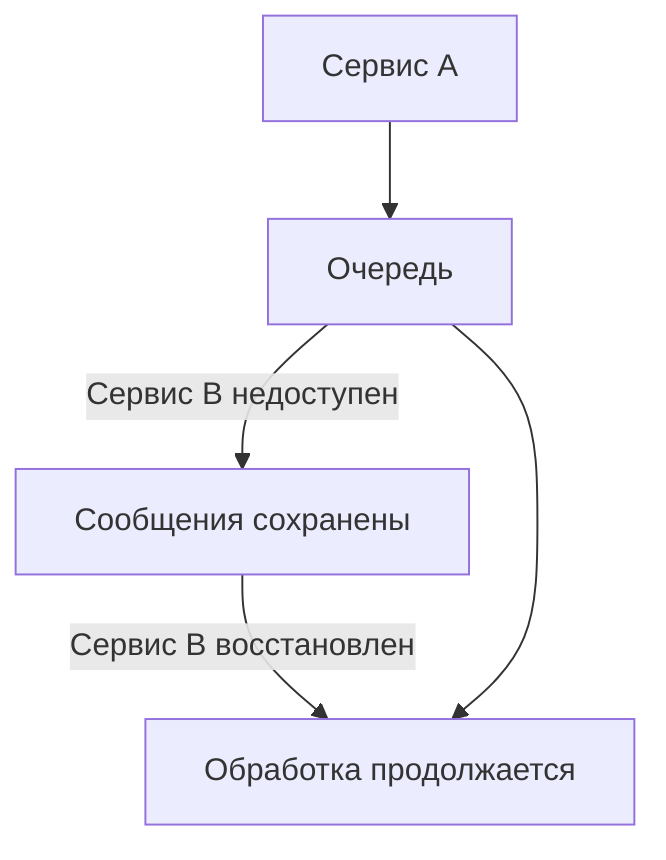

  

> [!info] Механизмы надежности

> - **Персистентность** — сообщения сохраняются на диск

> - **Acknowledgments (ACK)** — подтверждение успешной обработки

> - **Retry механизм** — повторные попытки при ошибках

> - **Dead Letter Queue** — очередь для проблемных сообщений

  

### 4. Масштабируемость

  

Легко добавлять больше обработчиков (workers):

  

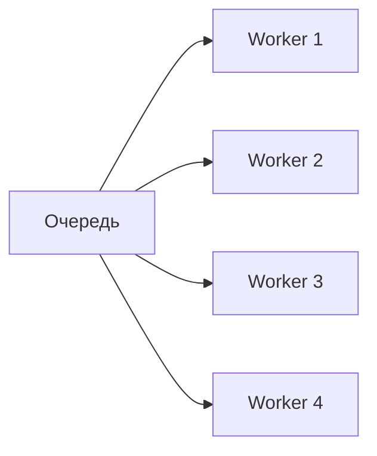

  

- Горизонтальное масштабирование

- Распределение нагрузки

- Независимое масштабирование отправителей и получателей

  

### 5. Развязка (Decoupling) компонентов

  

Сервисы не знают друг о друге напрямую:

  

| Без очереди | С очередей |

|---|---|

| `Service A → HTTP → Service B` (тесная связь) | `Service A → Queue → Service B` (слабая связь) |

  

> [!note] Преимущества

> - Сервисы могут разрабатываться независимо

> - Легкая замена или добавление сервисов

> - Разные языки программирования для разных сервисов

> - Изоляция сбоев

  

### 6. Порядок обработки

  

- **FIFO** (First In, First Out) — первым пришел, первым обработан

- **Priority queues** — приоритетные сообщения обрабатываются раньше

- **Отложенные задачи** — выполнение в определенное время

  

### 7. Распределенная обработка

  

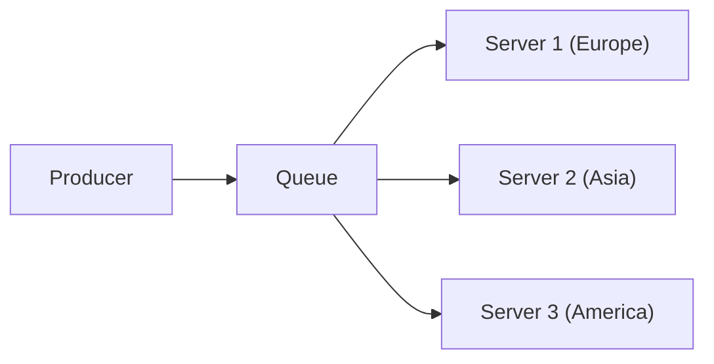

  

---

  

## Типичные use cases для очередей

  

### Email рассылки

  

```php

foreach ($users as $user) {

Queue::push(new SendEmailJob($user));

}

// Worker'ы отправляют письма в фоне

```

  

### Генерация отчетов

  

```php

Queue::push(new GenerateReportJob($params));

// Уведомление когда отчет готов

```

  

### Обработка медиа-файлов

  

- Конвертация видео

- Обработка изображений

- Генерация превью

- Создание субтитров

  

### Интеграции с внешними сервисами

  

```php

Queue::push(new SyncWithCRM($customer));

Queue::push(new SendToAnalytics($event));

Queue::push(new UpdateInventory($product));

```

  

### Уведомления

  

- Push-уведомления

- SMS

- Websocket события

- Webhooks

  

### Пакетная обработка

  

```php

Queue::push(new ImportProductsJob($file));

// Обработка по частям

```

  

### Периодические задачи

  

- Очистка старых данных

- Генерация резервных копий

- Обновление кэша

- Сбор метрик

  

---

  

## Концепции и паттерны

  

### 1. Producer-Consumer

  

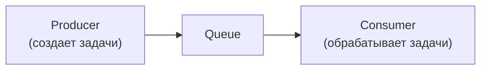

  

### 2. Pub/Sub (Publish-Subscribe)

  

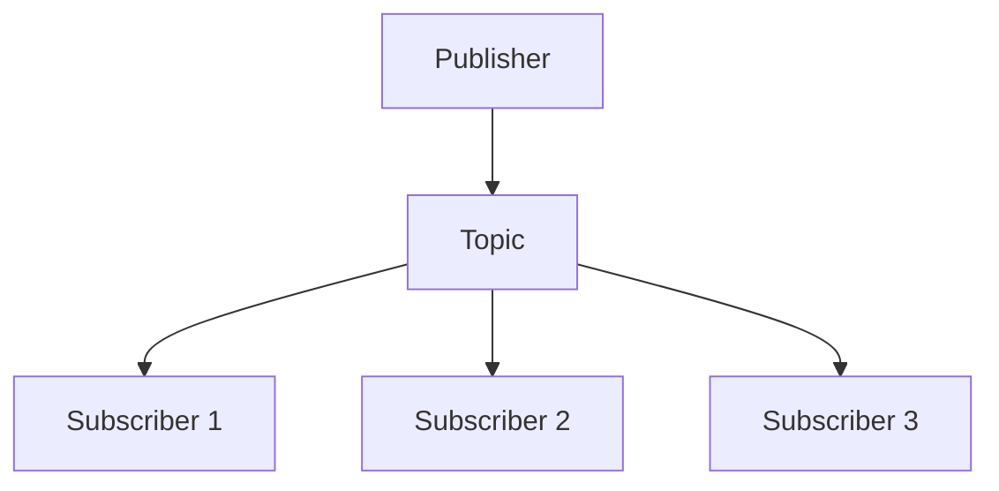

  

Одно сообщение доставляется **всем** подписчикам.

  

### 3. Request-Reply

  

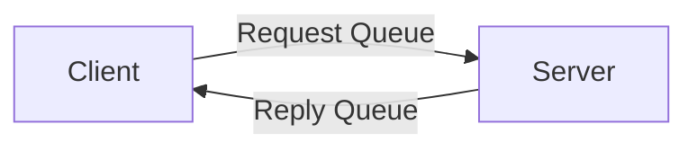

  

### 4. Work Queue (Task Queue)

  

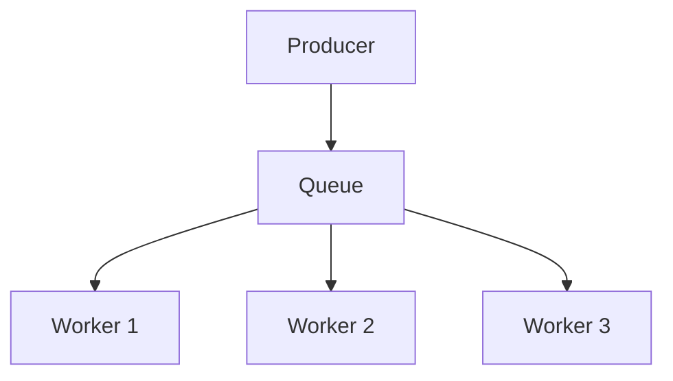

  

### 5. Priority Queue

  

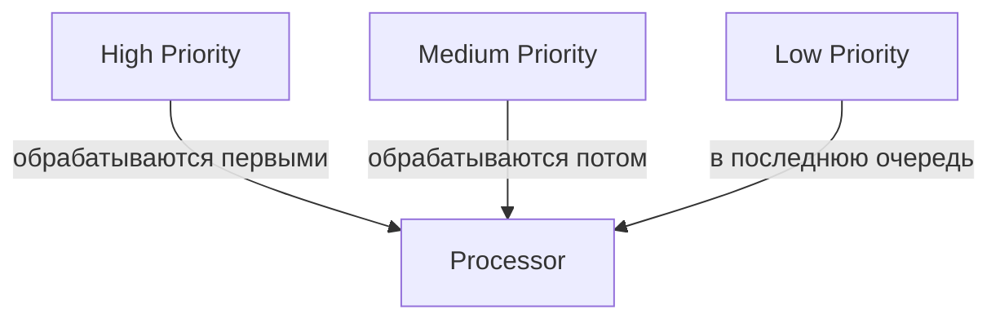

  

### 6. Dead Letter Queue (DLQ)

  

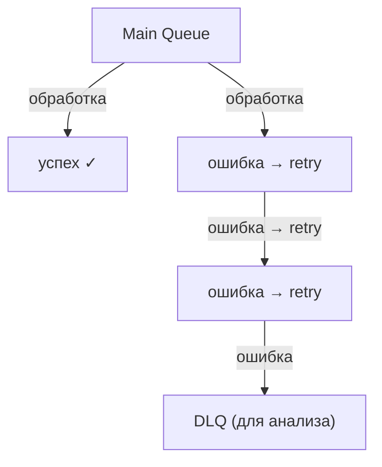

  

---

  

## Гарантии доставки

  

### At most once (максимум один раз)

  

- Сообщение может быть потеряно

- Никогда не обрабатывается дважды

- Самый быстрый режим

- Use case: метрики, логи

  

### At least once (минимум один раз)

  

- Сообщение гарантированно доставлено

- Может быть обработано несколько раз

- Нужна [[#Отказоустойчивость и надежность|идемпотентность]] обработки

- Use case: большинство приложений

  

### Exactly once (ровно один раз)

  

- Сообщение обрабатывается ровно один раз

- Самый сложный режим

- Требует координации и транзакций

- Use case: финансовые операции, платежи

  

> [!danger] Внимание

> Exactly once — самый сложный режим. Большинство брокеров гарантируют только *at least once*, а идемпотентность обеспечивается на уровне приложения.

  

---

  

## Когда НЕ нужны очереди

  

> [!caution] Не используйте очереди если:

> - **Критичное реал-таймовое взаимодействие** — видеозвонки, онлайн игры, алгоритмическая торговля

> - **Простые CRUD операции** — чтение/запись данных без дополнительной обработки

> - **Маленькие приложения** — если нет проблем с производительностью, дополнительная сложность не оправдана

> - **Когда важен немедленный результат** — авторизация пользователя, валидация данных в реальном времени

  

---

  

## Брокеры сообщений

  

Брокеры сообщений (Message Brokers) — промежуточное ПО, которое управляет очередями, маршрутизацией и доставкой сообщений между приложениями.

  

### 1. RabbitMQ

  

#rabbitmq #amqp

  

> [!abstract] Описание

> - Самый популярный open-source брокер

> - Реализует протокол [[AMQP]] (Advanced Message Queuing Protocol)

> - Написан на Erlang

> - Зрелое решение (с 2007 года)

  

**Особенности:**

  

- Гибкая маршрутизация через exchanges

- Множество плагинов и расширений

- Web-интерфейс для управления

- Поддержка кластеризации

- Гарантии доставки сообщений

- Персистентность

  

| Плюсы | Минусы |

|---|---|

| Богатая функциональность | Может быть сложен для новичков |

| Отличная документация | Производительность ниже чем у [[#2. Apache Kafka\|Kafka]] для больших объемов |

| Большое сообщество | Потребляет больше ресурсов |

| Стабильность и надежность | |

| Поддержка сложной маршрутизации | |

  

**Use cases:** [[#1. Producer-Consumer|Классические очереди задач]], [[#Масштабируемость|микросервисная архитектура]], [[#1. Асинхронная обработка задач|асинхронная обработка]]

  

**Примеры интеграций:** Laravel Queue, Celery (Python), Spring AMQP (Java)

  

### 2. Apache Kafka

  

#kafka #streaming

  

> [!abstract] Описание

> - Распределенная платформа потоковой обработки

> - Написана на Scala/Java

> - Разработана LinkedIn, теперь проект Apache

> - Высокая пропускная способность

  

**Особенности:**

  

- Лог-ориентированная архитектура

- Горизонтальное масштабирование

- Репликация данных

- Долгосрочное хранение сообщений

- Обработка событий в реальном времени

- Гарантии порядка в рамках партиции

  

| Плюсы | Минусы |

|---|---|

| Очень высокая производительность (миллионы сообщений/сек) | Сложность настройки и эксплуатации |

| Отлично масштабируется | Требует ZooKeeper (или KRaft в новых версиях) |

| Долгосрочное хранение событий | Overkill для простых use cases |

| Event sourcing и stream processing | Больше подходит для event streaming, чем task queues |

  

**Use cases:** Event streaming, обработка больших объемов данных, логи и метрики, CQRS и Event Sourcing, Real-time analytics

  

**Примеры:** LinkedIn (оригинальный use case), Uber (обработка геолокации), Netflix (мониторинг и логи)

  

### 3. Redis (Redis Streams / Redis Queue)

  

#redis

  

> [!abstract] Описание

> - In-memory хранилище данных

> - Поддерживает структуры данных Lists и Streams

> - Очень быстрая работа

  

| Плюсы | Минусы |

|---|---|

| Очень быстрый | Данные в памяти (риск потери при сбое) |

| Простая настройка | Ограниченная функциональность |

| Может быть уже установлен для кэширования | Нет сложной маршрутизации |

| Легкий для понимания | Не подходит для критичных задач |

  

**Use cases:** Простые очереди задач, кэширование + очереди, real-time лидерборды, rate limiting

  

**Примеры:** Sidekiq (Ruby), Bull/BullMQ (Node.js), Laravel Horizon

  

### 4. Amazon SQS (Simple Queue Service)

  

#aws #sqs #serverless

  

> [!abstract] Описание

> - Управляемый сервис очередей от AWS

> - Полностью serverless

> - Масштабируется автоматически

  

| Плюсы | Минусы |

|---|---|

| Нулевое администрирование | Vendor lock-in (AWS) |

| Автоматическое масштабирование | Задержки доставки могут быть выше |

| Высокая доступность | Ограниченная функциональность |

| Интеграция с Lambda, SNS | Стоимость при больших объемах |

  

**Use cases:** Приложения на AWS, serverless архитектуры, микросервисы в облаке

  

### 5. Apache ActiveMQ

  

#activemq #java

  

> [!abstract] Описание

> - Enterprise message broker, написан на Java

> - Проект Apache Software Foundation

  

| Плюсы | Минусы |

|---|---|

| Зрелое решение для enterprise | Производительность ниже конкурентов |

| Хорошая интеграция с Java | Сложная конфигурация |

| Поддержка многих протоколов | Менее популярен сейчас |

  

**Use cases:** Enterprise Java приложения, legacy системы

  

### 6. NATS

  

#nats #golang #cloud-native

  

> [!abstract] Описание

> - Легковесный и высокопроизводительный

> - Написан на Go

> - Cloud-native архитектура

  

| Плюсы | Минусы |

|---|---|

| Очень быстрый | Меньше функциональности |

| Минимальные требования к ресурсам | Нет персистентности (в базовой версии) |

| Простота | Меньшее сообщество |

  

**Use cases:** Микросервисы, IoT, cloud-native приложения, service mesh

  

### 7. Google Cloud Pub/Sub

  

#gcp #serverless

  

> [!abstract] Описание

> - Управляемый сервис от Google Cloud

> - Глобально распределенный, serverless

  

| Плюсы | Минусы |

|---|---|

| Нет управления инфраструктурой | Vendor lock-in (GCP) |

| Глобальная репликация | Стоимость |

| Высокая доступность | Задержки могут быть выше локальных решений |

  

### 8. Azure Service Bus

  

#azure #enterprise

  

> [!abstract] Описание

> - Управляемый сервис от Microsoft Azure

> - Enterprise messaging

  

| Плюсы | Минусы |

|---|---|

| Богатая функциональность | Vendor lock-in (Azure) |

| Enterprise-grade | Сложность |

| Интеграция с Azure | Стоимость |

  

---

  

## Сравнительная таблица брокеров

  

| Брокер | Производительность | Сложность | Надежность | Лучший Use Case |

|---|---|---|---|---|

| **RabbitMQ** | Средняя-Высокая | Средняя | Высокая | Универсальный |

| **Kafka** | Очень высокая | Высокая | Очень высокая | Event streaming |

| **Redis** | Очень высокая | Низкая | Средняя | Простые очереди |

| **SQS** | Средняя | Низкая | Высокая | AWS приложения |

| **ActiveMQ** | Средняя | Высокая | Высокая | Enterprise Java |

| **NATS** | Очень высокая | Низкая | Средняя | Микросервисы |

| **Pub/Sub** | Высокая | Низкая | Очень высокая | GCP приложения |

| **Service Bus** | Высокая | Средняя | Очень высокая | Azure приложения |

  

---

  

## Как выбрать брокер

  

> [!example] Рекомендации

>

> | Ситуация | Рекомендация |

> |---|---|

> | Для начинающих проектов | → [[#3. Redis (Redis Streams / Redis Queue)\|Redis]] или [[#1. RabbitMQ\|RabbitMQ]] |

> | Для микросервисов | → [[#1. RabbitMQ\|RabbitMQ]] или [[#6. NATS\|NATS]] |

> | Для обработки больших объемов данных | → [[#2. Apache Kafka\|Kafka]] |

> | Для AWS приложений | → [[#4. Amazon SQS (Simple Queue Service)\|SQS]] + SNS |

> | Для GCP приложений | → [[#7. Google Cloud Pub/Sub\|Cloud Pub/Sub]] |

> | Для Azure приложений | → [[#8. Azure Service Bus\|Azure Service Bus]] |

> | Для event streaming и analytics | → [[#2. Apache Kafka\|Kafka]] |

> | Для простых задач с уже установленным Redis | → [[#3. Redis (Redis Streams / Redis Queue)\|Redis]] |

  

---

  

## Принцип работы RabbitMQ

  

См. также: [[AMQP]], [[RabbitMQ Exchange Types]], [[RabbitMQ Best Practices]]

  

### Основные компоненты

  

**1. Producer (Производитель)** — приложение, которое отправляет сообщения.

  

```python

import pika

  

connection = pika.BlockingConnection(pika.ConnectionParameters('localhost'))

channel = connection.channel()

  

channel.queue_declare(queue='tasks')

channel.basic_publish(exchange='', routing_key='tasks', body='Hello World')

```

  

**2. Queue (Очередь)** — буфер, который хранит сообщения. Свойства:

  

- Имя очереди (уникальное)

- `Durable` — персистентность

- `Exclusive` — эксклюзивная для одного connection

- `Auto-delete` — автоматическое удаление

  

**3. Consumer (Потребитель)** — приложение, которое получает и обрабатывает сообщения.

  

```python

def callback(ch, method, properties, body):

print(f"Получено сообщение: {body}")

ch.basic_ack(delivery_tag=method.delivery_tag)

  

channel.basic_consume(queue='tasks', on_message_callback=callback)

channel.start_consuming()

```

  

**4. Exchange (Обменник)** — маршрутизатор сообщений. Получает сообщения от producers и направляет их в очереди.

  

**5. Binding (Связь)** — правило, связывающее exchange с queue через routing key.

  

**6. Routing Key** — метка сообщения, по которой exchange определяет куда отправить сообщение.

  

**7. Connection** — TCP соединение между приложением и RabbitMQ сервером.

  

**8. Channel** — виртуальное соединение внутри Connection.

  

### Типы Exchange

  

#### 1. Direct Exchange

  

Маршрутизация по **точному совпадению** routing key.

  

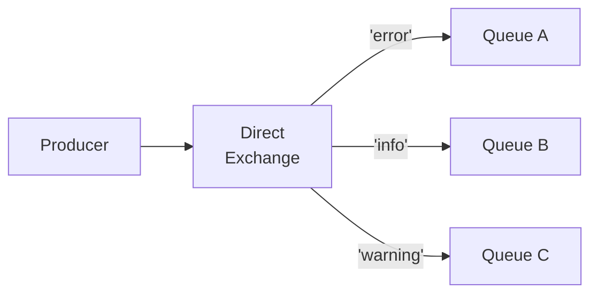

  

```python

# Producer

channel.exchange_declare(exchange='direct_logs', exchange_type='direct')

channel.basic_publish(

exchange='direct_logs',

routing_key='error',

body='Error message'

)

  

# Consumer

channel.queue_bind(exchange='direct_logs', queue='error_queue', routing_key='error')

```

  

> [!tip] Use case

> Логирование по уровням (error, warning, info), маршрутизация по типу задачи

  

#### 2. Fanout Exchange

  

**Broadcast** — отправляет сообщение во **все** привязанные очереди, игнорируя routing key.

  

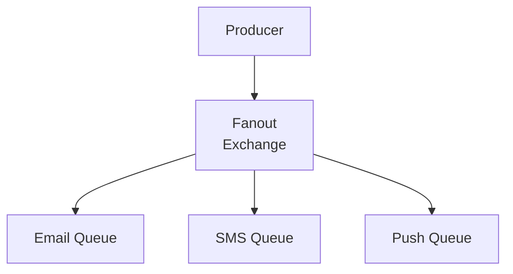

  

```python

# Producer

channel.exchange_declare(exchange='notifications', exchange_type='fanout')

channel.basic_publish(exchange='notifications', routing_key='', body='New user registered')

  

# Consumers

channel.queue_bind(exchange='notifications', queue='email_queue')

channel.queue_bind(exchange='notifications', queue='sms_queue')

channel.queue_bind(exchange='notifications', queue='push_queue')

```

  

> [!tip] Use case

> Уведомления (email, SMS, push одновременно), инвалидация кэша на всех серверах

  

#### 3. Topic Exchange

  

Маршрутизация по **паттернам** routing key с использованием wildcards:

  

- `*` — одно слово

- `#` — ноль или более слов

  

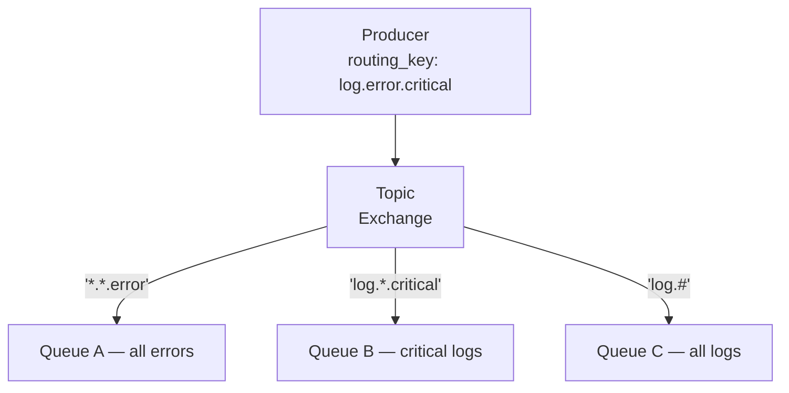

  

```python

# Producer

channel.exchange_declare(exchange='topic_logs', exchange_type='topic')

channel.basic_publish(

exchange='topic_logs',

routing_key='app.payment.error',

body='Payment failed'

)

  

# Consumers

channel.queue_bind(exchange='topic_logs', queue='all_errors', routing_key='*.*.error')

channel.queue_bind(exchange='topic_logs', queue='payment_logs', routing_key='app.payment.*')

channel.queue_bind(exchange='topic_logs', queue='all_logs', routing_key='app.#')

```

  

> [!tip] Use case

> Сложная маршрутизация логов, микросервисная архитектура, event-driven системы с категоризацией

  

#### 4. Headers Exchange

  

Маршрутизация по **заголовкам** сообщения (headers), а не routing key.

  

```python

# Producer

channel.exchange_declare(exchange='headers_exchange', exchange_type='headers')

channel.basic_publish(

exchange='headers_exchange',

routing_key='',

body='Message',

properties=pika.BasicProperties(

headers={'format': 'pdf', 'type': 'report'}

)

)

  

# Consumer

channel.queue_bind(

exchange='headers_exchange',

queue='pdf_reports',

arguments={'x-match': 'all', 'format': 'pdf', 'type': 'report'}

)

```

  

> [!tip] Use case

> Сложные правила маршрутизации, фильтрация по множеству параметров

  

### Как работает доставка сообщений

  

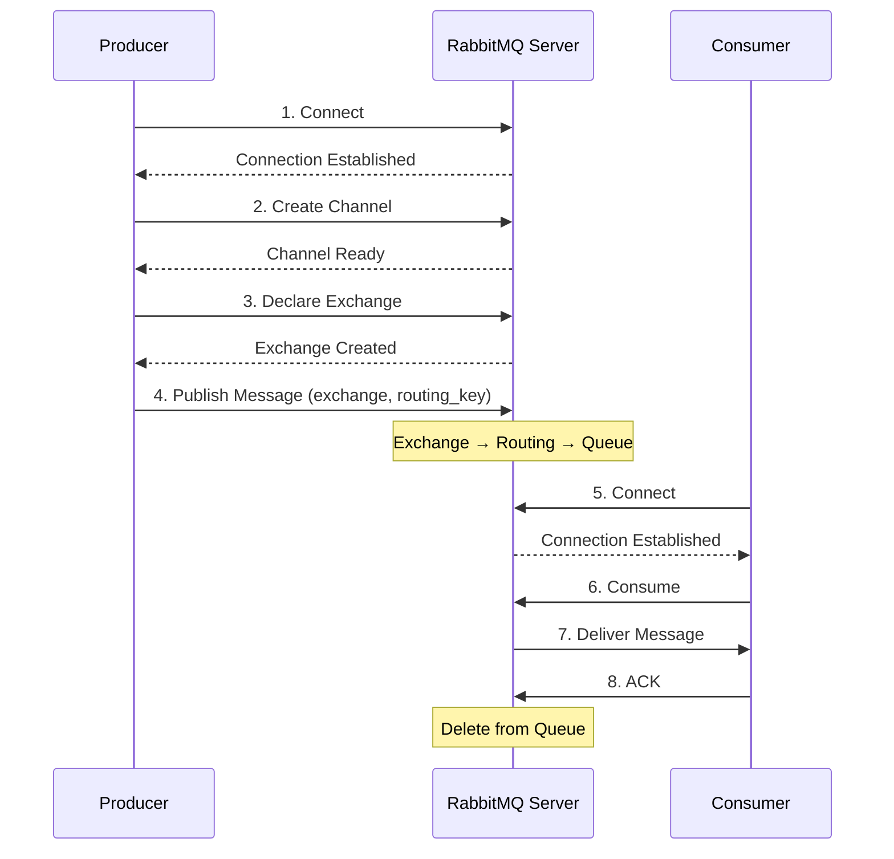

  

### Acknowledgments (Подтверждения)

  

**Manual ACK (рекомендуется):**

  

```python

def callback(ch, method, properties, body):

try:

process_message(body)

ch.basic_ack(delivery_tag=method.delivery_tag)

except Exception as e:

ch.basic_nack(delivery_tag=method.delivery_tag, requeue=True)

  

channel.basic_consume(queue='tasks', on_message_callback=callback, auto_ack=False)

```

  

> [!danger] Auto ACK (не рекомендуется)

> ```python

> channel.basic_consume(queue='tasks', on_message_callback=callback, auto_ack=True)

> ```

> RabbitMQ удаляет сообщение **сразу после отправки**. Если consumer упадет — сообщение потеряно!

  

**Типы ответов:**

  

| Тип | Описание |

|---|---|

| `basic_ack` | Сообщение обработано, можно удалить |

| `basic_nack` | Ошибка, вернуть в очередь или отклонить |

| `basic_reject` | Отклонить одно сообщение |

  

### Персистентность (Durability)

  

> [!important] Для полной персистентности нужны все три компонента!

  

```python

# 1. Durable Exchange

channel.exchange_declare(exchange='my_exchange', durable=True)

  

# 2. Durable Queue

channel.queue_declare(queue='my_queue', durable=True)

  

# 3. Persistent Messages

channel.basic_publish(

exchange='my_exchange',

routing_key='my_key',

body='message',

properties=pika.BasicProperties(

delivery_mode=2 # персистентное сообщение

)

)

```

  

### Prefetch и Quality of Service (QoS)

  

Ограничивает количество unacknowledged сообщений на consumer:

  

```python

channel.basic_qos(prefetch_count=5)

```

  

**Зачем это нужно:**

  

- Равномерное распределение нагрузки между workers

- Предотвращение перегрузки медленных workers

- Быстрые workers берут больше задач

  

### Dead Letter Exchange (DLX)

  

Куда отправляются сообщения, которые:

  

- Отклонены consumer'ом (reject/nack с `requeue=false`)

- Истекло TTL (Time To Live)

- Очередь переполнена (при `max-length`)

  

```python

# Создаем DLX

channel.exchange_declare(exchange='dlx', exchange_type='direct')

channel.queue_declare(queue='dead_letter_queue')

channel.queue_bind(exchange='dlx', queue='dead_letter_queue', routing_key='failed')

  

# Основная очередь с DLX

channel.queue_declare(

queue='main_queue',

arguments={

'x-dead-letter-exchange': 'dlx',

'x-dead-letter-routing-key': 'failed',

'x-message-ttl': 60000 # 60 секунд TTL

}

)

```

  

### Priority Queues (Приоритетные очереди)

  

```python

# Создание приоритетной очереди (0-255)

channel.queue_declare(

queue='priority_queue',

arguments={'x-max-priority': 10}

)

  

# Отправка с приоритетом

channel.basic_publish(

exchange='',

routing_key='priority_queue',

body='High priority task',

properties=pika.BasicProperties(priority=9)

)

  

channel.basic_publish(

exchange='',

routing_key='priority_queue',

body='Low priority task',

properties=pika.BasicProperties(priority=1)

)

```

  

### Clustering и High Availability

  

**Cluster:** несколько узлов RabbitMQ работают вместе. Метаданные реплицируются, сообщения — нет.

  

```python

# Создание реплицированной очереди (RabbitMQ 3.8+)

channel.queue_declare(

queue='ha_queue',

arguments={

'x-queue-type': 'quorum'

}

)

```

  

### Мониторинг и управление

  

```bash

# Включение management plugin

rabbitmq-plugins enable rabbitmq_management

# Web UI: http://localhost:15672 (guest/guest)

  

# CLI

rabbitmqctl list_queues

rabbitmqctl list_exchanges

rabbitmqctl list_connections

rabbitmqctl cluster_status

```

  

---

  

## Best Practices

  

> [!success] Чеклист

>

> - [x] Всегда используйте **Manual ACK** (`auto_ack=False`)

> - [ ] Делайте операции **идемпотентными** — сообщение может быть доставлено дважды

> - [ ] Используйте **persisted messages** для критичных данных (`delivery_mode=2`)

> - [ ] Настраивайте **prefetch** (`channel.basic_qos(prefetch_count=10)`)

> - [ ] Используйте **Dead Letter Queues** для анализа и повторной обработки ошибок

> - [ ] **Мониторьте** очереди (длина, скорость обработки, unacked messages)

> - [ ] Создавайте **отдельные exchanges** для разных целей

> - [ ] Используйте **connection pooling** — не создавайте connection для каждого сообщения

> - [ ] Настраивайте **TTL** — избегайте бесконечного накопления старых сообщений

> - [ ] **Тестируйте отказоустойчивость** (падение consumer, падение RabbitMQ, повторные сообщения)

  

---

  

## Пример реального приложения

  

### Архитектура: Интернет-магазин с RabbitMQ

  

Рассмотрим полный пример интернет-магазина, где RabbitMQ связывает несколько сервисов.

  

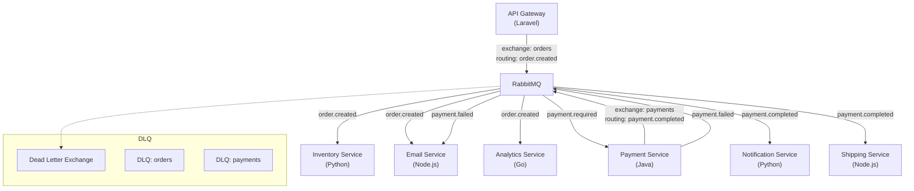

  

### Producer — API Gateway (Laravel)

  

```php

// app/Jobs/PublishOrderCreatedJob.php

  

class PublishOrderCreatedJob implements ShouldQueue

{

use Dispatchable, InteractsWithQueue, Queueable, SerializesModels;

  

public function __construct(

public Order $order

) {}

  

public function handle(RabbitMQService $rabbit): void

{

$rabbit->publish(

exchange: 'orders',

routingKey: 'order.created',

message: json_encode([

'order_id' => $this->order->id,

'user_id' => $this->order->user_id,

'items' => $this->order->items->toArray(),

'total' => $this->order->total,

'created_at' => $this->order->created_at->toIso8601String(),

]),

properties: [

'delivery_mode' => 2,

'content_type' => 'application/json',

'message_id' => (string) Str::uuid(),

'timestamp' => time(),

]

);

}

}

```

  

```php

// app/Http/Controllers/OrderController.php

  

class OrderController extends Controller

{

public function store(Request $request)

{

$order = DB::transaction(function () use ($request) {

$order = Order::create($request->validated());

foreach ($request->items as $item) {

$order->items()->create($item);

}

return $order;

});

  

PublishOrderCreatedJob::dispatch($order);

  

return response()->json([

'message' => 'Заказ принят в обработку',

'order_id' => $order->id,

], 202);

}

}

```

  

### Consumer — Inventory Service (Python)

  

```python

# inventory_service/consumer.py

  

import json

import pika

import logging

from inventory import reserve_stock, check_availability

from retry import retry

  

logger = logging.getLogger(__name__)

  

class OrderConsumer:

def __init__(self):

self.connection = pika.BlockingConnection(

pika.ConnectionParameters(

host='rabbitmq',

heartbeat=600,

blocked_connection_timeout=300,

)

)

self.channel = self.connection.channel()

self._setup()

  

def _setup(self):

self.channel.exchange_declare(

exchange='orders', exchange_type='topic', durable=True

)

self.channel.exchange_declare(

exchange='dlx', exchange_type='direct', durable=True

)

  

self.channel.queue_declare(

queue='inventory_orders',

durable=True,

arguments={

'x-dead-letter-exchange': 'dlx',

'x-dead-letter-routing-key': 'inventory_failed',

'x-message-ttl': 300000,

},

)

self.channel.queue_bind(

exchange='orders',

queue='inventory_orders',

routing_key='order.created',

)

  

self.channel.queue_declare(queue='inventory_dlq', durable=True)

self.channel.queue_bind(

exchange='dlx', queue='inventory_dlq', routing_key='inventory_failed'

)

  

self.channel.basic_qos(prefetch_count=5)

  

@retry(pika.exceptions.AMQPConnectionError, delay=5, jitter=(1, 3))

def start(self):

self.channel.basic_consume(

queue='inventory_orders',

on_message_callback=self._handle_message,

auto_ack=False,

)

logger.info('Inventory consumer started')

self.channel.start_consuming()

  

def _handle_message(self, ch, method, properties, body):

message_id = properties.message_id or 'unknown'

try:

data = json.loads(body)

logger.info(f'Processing order {data["order_id"]} (msg: {message_id})')

  

if not check_availability(data['items']):

logger.warning(f'Insufficient stock for order {data["order_id"]}')

ch.basic_nack(delivery_tag=method.delivery_tag, requeue=False)

return

  

reserve_stock(data['order_id'], data['items'])

logger.info(f'Stock reserved for order {data["order_id"]}')

ch.basic_ack(delivery_tag=method.delivery_tag)

  

except json.JSONDecodeError as e:

logger.error(f'Invalid JSON in message {message_id}: {e}')

ch.basic_nack(delivery_tag=method.delivery_tag, requeue=False)

except Exception as e:

logger.error(f'Error processing message {message_id}: {e}')

ch.basic_nack(delivery_tag=method.delivery_tag, requeue=True)

  
  

if __name__ == '__main__':

consumer = OrderConsumer()

consumer.start()

```

  

### Consumer — Email Service (Node.js)

  

```javascript

// email-service/consumer.js

  

const amqp = require('amqplib');

const { sendOrderConfirmation, sendPaymentFailed } = require('./mailer');

  

const QUEUE = 'email_orders';

const EXCHANGE = 'orders';

  

async function start() {

const connection = await amqp.connect('amqp://rabbitmq');

const channel = await connection.createChannel();

  

await channel.assertExchange(EXCHANGE, 'topic', { durable: true });

await channel.assertQueue(QUEUE, {

durable: true,

arguments: {

'x-dead-letter-exchange': 'dlx',

'x-dead-letter-routing-key': 'email_failed',

},

});

await channel.bindQueue(QUEUE, EXCHANGE, 'order.created');

await channel.bindQueue(QUEUE, EXCHANGE, 'payment.failed');

await channel.prefetch(5);

  

channel.consume(QUEUE, async (msg) => {

try {

const data = JSON.parse(msg.content.toString());

const routingKey = msg.fields.routingKey;

  

if (routingKey === 'order.created') {

await sendOrderConfirmation(data);

} else if (routingKey === 'payment.failed') {

await sendPaymentFailed(data);

}

  

channel.ack(msg);

} catch (err) {

console.error('Email processing error:', err);

channel.nack(msg, false, true);

}

});

  

console.log('Email consumer started');

}

  

start().catch(console.error);

```

  

### Consumer — Payment Service (Java)

  

```java

// payment-service/src/main/java/com/shop/payment/OrderListener.java

  

@Component

public class OrderListener {

  

private final PaymentService paymentService;

private final RabbitTemplate rabbitTemplate;

  

@RabbitListener(queues = "payment_orders")

public void handleOrderCreated(Message message) {

String routingKey = message.getMessageProperties().getReceivedRoutingKey();

String body = new String(message.getBody());

  

try {

if ("order.created".equals(routingKey)) {

OrderEvent event = objectMapper.readValue(body, OrderEvent.class);

PaymentResult result = paymentService.processPayment(event);

  

rabbitTemplate.convertAndSend(

"payments",

result.isSuccess() ? "payment.completed" : "payment.failed",

objectMapper.writeValueAsString(result)

);

}

} catch (Exception e) {

log.error("Payment processing failed", e);

throw new AmqpRejectAndDontRequeueException("Payment failed", e);

}

}

}

```

  

### Docker Compose для всей системы

  

```yaml

# docker-compose.yml

  

version: '3.8'

  

services:

rabbitmq:

image: rabbitmq:3-management

ports:

- "5672:5672"

- "15672:15672"

environment:

RABBITMQ_DEFAULT_USER: shop_user

RABBITMQ_DEFAULT_PASS: ${RABBITMQ_PASS}

volumes:

- rabbitmq_data:/var/lib/rabbitmq

healthcheck:

test: rabbitmq-diagnostics -q ping

interval: 30s

timeout: 10s

retries: 5

  

api:

build: ./api-gateway

ports:

- "8000:8000"

depends_on:

rabbitmq:

condition: service_healthy

environment:

RABBITMQ_HOST: rabbitmq

  

inventory-service:

build: ./inventory-service

depends_on:

rabbitmq:

condition: service_healthy

environment:

RABBITMQ_HOST: rabbitmq

deploy:

replicas: 2

  

email-service:

build: ./email-service

depends_on:

rabbitmq:

condition: service_healthy

environment:

RABBITMQ_HOST: rabbitmq

  

payment-service:

build: ./payment-service

depends_on:

rabbitmq:

condition: service_healthy

environment:

RABBITMQ_HOST: rabbitmq

  

volumes:

rabbitmq_data:

```

  

> [!example] Что демонстрирует пример

>

> | Концепция | Где применяется |

> |---|---|

> | [[#3. Topic Exchange\|Topic Exchange]] | Маршрутизация `order.created`, `payment.completed`, `payment.failed` |

> | [[#Персистентность (Durability)\|Персистентность]] | `delivery_mode=2` для всех критичных сообщений |

> | [[#Acknowledgments (Подтверждения)\|Manual ACK]] | Все consumer'ы подтверждают обработку вручную |

> | [[#Dead Letter Exchange (DLX)\|DLX]] | Проблемные сообщения попадают в dead letter queue |

> | [[#Prefetch и Quality of Service (QoS)\|Prefetch]] | Каждый consumer обрабатывает до 5 сообщений одновременно |

> | [[#5. Развязка (Decoupling) компонентов\|Decoupling]] | Каждый сервис на своем языке (PHP, Python, JS, Java) |

> | [[#2. Сглаживание пиковых нагрузок (Load Leveling)\|Load Leveling]] | 2 реплики inventory-service для масштабирования |